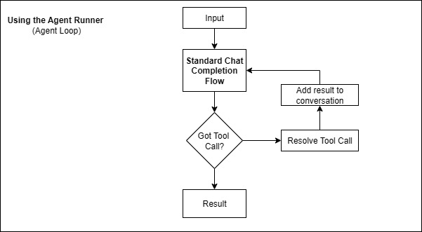

# Chat Runtime

The Chat Runtime provides a powerful framework for building conversational AI applications with advanced flow control, agent coordination, and state management.

## Overview

Chat Runtime enables you to create sophisticated conversational workflows that go beyond simple question-and-answer patterns. It provides structured ways to:

- Manage conversation flow between multiple agents
- Handle complex state transitions
- Coordinate parallel and sequential operations
- Implement advanced conversational patterns


## Core Concepts

### Runtime Configuration

All Chat Runtime workflows are built around `IRuntimeConfiguration` implementations that define how agents interact:

```csharp
using LlmTornado.Agents.ChatRuntime;

// Create a runtime with a specific configuration
ChatRuntime runtime = new ChatRuntime(configuration);

// Execute the runtime
ChatMessage result = await runtime.InvokeAsync(
    new ChatMessage(ChatMessageRoles.User, "Your message here")
);
```

### Runtime Events

Monitor runtime execution with event handlers:

```csharp
ValueTask HandleRuntimeEvents(ChatRuntimeEvents runtimeEvent)
{
    switch (runtimeEvent.EventType)
    {
        case ChatRuntimeEventTypes.AgentStarted:
            Console.WriteLine($"Agent started: {runtimeEvent.AgentName}");
            break;
        case ChatRuntimeEventTypes.AgentCompleted:
            Console.WriteLine($"Agent completed: {runtimeEvent.AgentName}");
            break;
        case ChatRuntimeEventTypes.StreamingOutput:
            if (runtimeEvent is ChatRuntimeStreamingEvent streamEvent)
            {
                Console.Write(streamEvent.Content);
            }
            break;
    }
    return ValueTask.CompletedTask;
}

runtime.OnRuntimeEvent = HandleRuntimeEvents;
```

## Standard Process Flow

The standard conversation flow with agents follows this pattern:


1. **User Input** - Receive message from user
2. **Agent Processing** - Agent processes the message
3. **Tool Invocation** - Agent calls tools if needed
4. **Response Generation** - Agent generates response
5. **Output** - Return response to user

## Agent Runner Loop

For more complex scenarios, the Agent Runner automatically handles tool invocation:



This loop automatically:
- Detects when tools need to be called
- Executes the appropriate tools
- Feeds results back to the agent
- Continues until a final response is ready

## Runtime Configurations

### Basic Runtime Agent

Create simple runtime agents for basic scenarios:

```csharp
using LlmTornado.Agents.ChatRuntime;

RuntimeAgent agent = new RuntimeAgent(
    client: client,
    model: ChatModel.OpenAi.Gpt41.V41Mini,
    name: "Assistant",
    instructions: "You are a helpful assistant",
    streaming: true
);

// Use in a simple configuration
ChatRuntime runtime = new ChatRuntime(new BasicRuntimeConfiguration(agent));
```

### Custom Runtime Configuration

Implement your own runtime configuration:

```csharp
public class CustomRuntimeConfiguration : IRuntimeConfiguration
{
    public CancellationTokenSource cts { get; set; }
    
    private readonly RuntimeAgent _agent;
    
    public CustomRuntimeConfiguration(RuntimeAgent agent)
    {
        _agent = agent;
    }
    
    public async Task<ChatMessage> InvokeAsync(
        ChatMessage input, 
        Func<ChatRuntimeEvents, ValueTask>? onRuntimeEvent = null)
    {
        // Emit start event
        if (onRuntimeEvent != null)
        {
            await onRuntimeEvent(new ChatRuntimeAgentStartedEvent(_agent.Name));
        }
        
        // Process with agent
        var result = await _agent.InvokeAsync(input, onRuntimeEvent);
        
        // Emit completion event
        if (onRuntimeEvent != null)
        {
            await onRuntimeEvent(new ChatRuntimeAgentCompletedEvent(_agent.Name));
        }
        
        return result;
    }
}
```

## Streaming Support

Enable real-time streaming responses:

```csharp
// Create streaming-enabled agent
RuntimeAgent streamingAgent = new RuntimeAgent(
    client,
    ChatModel.OpenAi.Gpt41.V41Mini,
    name: "StreamingAssistant",
    instructions: "You are a helpful assistant",
    streaming: true // Enable streaming
);

// Handle streaming events
ValueTask HandleStreaming(ChatRuntimeEvents runtimeEvent)
{
    if (runtimeEvent is ChatRuntimeStreamingEvent streamEvent)
    {
        Console.Write(streamEvent.Content);
    }
    return ValueTask.CompletedTask;
}

var configuration = new BasicRuntimeConfiguration(streamingAgent);
var runtime = new ChatRuntime(configuration);
runtime.OnRuntimeEvent = HandleStreaming;

// Execute with real-time output
var result = await runtime.InvokeAsync(
    new ChatMessage(ChatMessageRoles.User, "Tell me a story")
);
```

## Error Handling

Implement robust error handling in runtime configurations:

```csharp
public class RobustRuntimeConfiguration : IRuntimeConfiguration
{
    public CancellationTokenSource cts { get; set; }
    private readonly RuntimeAgent _agent;
    private readonly int _maxRetries;
    
    public RobustRuntimeConfiguration(RuntimeAgent agent, int maxRetries = 3)
    {
        _agent = agent;
        _maxRetries = maxRetries;
    }
    
    public async Task<ChatMessage> InvokeAsync(
        ChatMessage input, 
        Func<ChatRuntimeEvents, ValueTask>? onRuntimeEvent = null)
    {
        for (int attempt = 1; attempt <= _maxRetries; attempt++)
        {
            try
            {
                return await _agent.InvokeAsync(input, onRuntimeEvent);
            }
            catch (Exception ex) when (attempt < _maxRetries)
            {
                // Emit error event
                if (onRuntimeEvent != null)
                {
                    await onRuntimeEvent(new ChatRuntimeErrorEvent(
                        $"Attempt {attempt} failed: {ex.Message}",
                        _agent.Name
                    ));
                }
                
                // Wait before retry
                await Task.Delay(TimeSpan.FromSeconds(Math.Pow(2, attempt)));
            }
        }
        
        throw new Exception($"Failed after {_maxRetries} attempts");
    }
}
```

## Advanced Patterns

### Context Management

Manage conversation context across runtime invocations:

```csharp
public class ContextualRuntimeConfiguration : IRuntimeConfiguration
{
    public CancellationTokenSource cts { get; set; }
    private readonly RuntimeAgent _agent;
    private readonly List<ChatMessage> _context = new();
    private readonly int _maxContextLength;
    
    public ContextualRuntimeConfiguration(RuntimeAgent agent, int maxContextLength = 10)
    {
        _agent = agent;
        _maxContextLength = maxContextLength;
    }
    
    public async Task<ChatMessage> InvokeAsync(
        ChatMessage input, 
        Func<ChatRuntimeEvents, ValueTask>? onRuntimeEvent = null)
    {
        // Add input to context
        _context.Add(input);
        
        // Trim context if too long
        if (_context.Count > _maxContextLength)
        {
            _context.RemoveRange(0, _context.Count - _maxContextLength);
        }
        
        // Create conversation with full context
        var conversation = _agent.Client.Chat.CreateConversation();
        foreach (var message in _context)
        {
            conversation.AppendMessage(message);
        }
        
        // Process with context
        var result = await _agent.InvokeAsync(input, onRuntimeEvent);
        
        // Add result to context
        _context.Add(result);
        
        return result;
    }
}
```

### Agent Switching

Switch between different agents based on input:

```csharp
public class SwitchingRuntimeConfiguration : IRuntimeConfiguration
{
    public CancellationTokenSource cts { get; set; }
    
    private readonly Dictionary<string, RuntimeAgent> _agents;
    private readonly RuntimeAgent _routerAgent;
    
    public SwitchingRuntimeConfiguration(
        Dictionary<string, RuntimeAgent> agents,
        RuntimeAgent routerAgent)
    {
        _agents = agents;
        _routerAgent = routerAgent;
    }
    
    public async Task<ChatMessage> InvokeAsync(
        ChatMessage input, 
        Func<ChatRuntimeEvents, ValueTask>? onRuntimeEvent = null)
    {
        // Use router to determine which agent to use
        var routingResult = await _routerAgent.InvokeAsync(
            new ChatMessage(ChatMessageRoles.User, 
                $"Which agent should handle this: {input.Content}\\nOptions: {string.Join(", ", _agents.Keys)}")
        );
        
        var selectedAgent = routingResult.Content.Trim();
        
        if (_agents.TryGetValue(selectedAgent, out var agent))
        {
            return await agent.InvokeAsync(input, onRuntimeEvent);
        }
        
        // Fallback to first agent
        return await _agents.Values.First().InvokeAsync(input, onRuntimeEvent);
    }
}
```

## Performance Optimization

### Connection Pooling

Reuse agent connections for better performance:

```csharp
public class PooledRuntimeConfiguration : IRuntimeConfiguration
{
    public CancellationTokenSource cts { get; set; }
    
    private readonly ConcurrentQueue<RuntimeAgent> _agentPool;
    private readonly Func<RuntimeAgent> _agentFactory;
    private readonly int _maxPoolSize;
    
    public PooledRuntimeConfiguration(Func<RuntimeAgent> agentFactory, int maxPoolSize = 5)
    {
        _agentFactory = agentFactory;
        _maxPoolSize = maxPoolSize;
        _agentPool = new ConcurrentQueue<RuntimeAgent>();
        
        // Pre-populate pool
        for (int i = 0; i < maxPoolSize; i++)
        {
            _agentPool.Enqueue(_agentFactory());
        }
    }
    
    public async Task<ChatMessage> InvokeAsync(
        ChatMessage input, 
        Func<ChatRuntimeEvents, ValueTask>? onRuntimeEvent = null)
    {
        // Get agent from pool
        if (!_agentPool.TryDequeue(out var agent))
        {
            agent = _agentFactory();
        }
        
        try
        {
            return await agent.InvokeAsync(input, onRuntimeEvent);
        }
        finally
        {
            // Return agent to pool
            if (_agentPool.Count < _maxPoolSize)
            {
                _agentPool.Enqueue(agent);
            }
        }
    }
}
```

### Caching

Implement response caching:

```csharp
public class CachingRuntimeConfiguration : IRuntimeConfiguration
{
    public CancellationTokenSource cts { get; set; }
    
    private readonly RuntimeAgent _agent;
    private readonly Dictionary<string, ChatMessage> _cache = new();
    private readonly TimeSpan _cacheExpiry;
    private readonly Dictionary<string, DateTime> _cacheTimestamps = new();
    
    public CachingRuntimeConfiguration(RuntimeAgent agent, TimeSpan cacheExpiry)
    {
        _agent = agent;
        _cacheExpiry = cacheExpiry;
    }
    
    public async Task<ChatMessage> InvokeAsync(
        ChatMessage input, 
        Func<ChatRuntimeEvents, ValueTask>? onRuntimeEvent = null)
    {
        var key = input.Content.GetHashCode().ToString();
        
        // Check cache
        if (_cache.TryGetValue(key, out var cachedResult) &&
            _cacheTimestamps.TryGetValue(key, out var timestamp) &&
            DateTime.UtcNow - timestamp < _cacheExpiry)
        {
            return cachedResult;
        }
        
        // Execute and cache
        var result = await _agent.InvokeAsync(input, onRuntimeEvent);
        _cache[key] = result;
        _cacheTimestamps[key] = DateTime.UtcNow;
        
        return result;
    }
}
```

## Best Practices

### Configuration Design

1. **Single Responsibility**: Each configuration should have a clear, single purpose
2. **Composability**: Design configurations to work together
3. **Error Handling**: Always implement robust error handling
4. **Resource Management**: Properly manage resources and connections

### Event Handling

1. **Async Events**: Keep event handlers lightweight and async
2. **Error Propagation**: Don't let event handler errors break the runtime
3. **Structured Events**: Use strongly-typed event objects
4. **Logging**: Use events for monitoring and debugging

### Performance

1. **Connection Reuse**: Pool and reuse agent connections
2. **Caching**: Cache responses when appropriate
3. **Streaming**: Use streaming for long responses
4. **Cancellation**: Support cancellation for long-running operations

## Troubleshooting

### Common Issues

**Runtime Configuration Errors**
```
Error: Runtime configuration failed to initialize
```
Solution: Check agent configuration, ensure all required parameters are provided.

**Event Handler Exceptions**
```
Error: Event handler threw exception
```
Solution: Wrap event handlers in try-catch blocks, don't let them propagate errors.

**Memory Leaks**
```
Error: Increasing memory usage over time
```
Solution: Implement proper disposal patterns, clear caches periodically.

## Next Steps

- Learn about specific [Sequential Runtime](sequential-runtime.md) patterns
- Explore [Handoff Runtime](handoff-runtime.md) for dynamic agent switching
- Discover [Orchestration Runtime](orchestration-runtime.md) for complex workflows
- Check [Examples](examples/) for complete implementations