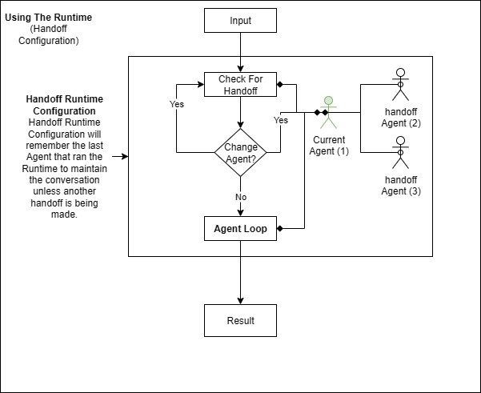

# Handoff Runtime

Handoff Runtime Configuration enables dynamic agent switching based on context, allowing agents to transfer control to specialized agents when needed.

## Overview

Handoff Runtime creates a network of connected agents where:
- Agents can transfer control to other specialized agents
- The system determines the best agent for each specific task
- Agents can hand control back and forth as needed
- Complex multi-agent workflows emerge naturally



This pattern is ideal for scenarios where different agents have specialized capabilities and need to collaborate dynamically.

## Basic Handoff Configuration

### Simple Agent Handoff

```csharp
using LlmTornado.Agents.ChatRuntime.RuntimeConfigurations;

// Create specialized agents
HandoffAgent translatorAgent = new HandoffAgent(
    client: client,
    description: "Use this Agent for spanish speaking response",
    model: ChatModel.OpenAi.Gpt41.V41Mini,
    name: "SpanishAgent",
    instructions: "You are a useful assistant. Please only respond in spanish"
);

HandoffAgent englishAgent = new HandoffAgent(
    client: client,
    description: "Use this Agent for english speaking response",
    model: ChatModel.OpenAi.Gpt41.V41Mini,
    name: "EnglishAgent",
    instructions: "You are a useful assistant. Please only respond in english",
    handoffs: [translatorAgent] // Can hand off to translator
);

// Set up bidirectional handoff
translatorAgent.HandoffAgents = [englishAgent];

// Create handoff configuration
HandoffRuntimeConfiguration runtimeConfiguration = new HandoffRuntimeConfiguration(englishAgent);

// Create and run runtime
ChatRuntime runtime = new ChatRuntime(runtimeConfiguration);
ChatMessage result = await runtime.InvokeAsync(
    new ChatMessage(ChatMessageRoles.User, "¿cuanto es 2+2?")
);

Console.WriteLine(result.Content);
```

## Advanced Handoff Patterns

### Multi-Specialist Network

Create a network of specialized agents:

```csharp
// Technical Support Agent
HandoffAgent techSupportAgent = new HandoffAgent(
    client: client,
    description: "Use for technical support and troubleshooting questions",
    model: ChatModel.OpenAi.Gpt41.V41Mini,
    name: "TechSupport",
    instructions: """
        You are a technical support specialist. Help users with:
        - Software issues and bugs
        - System configuration problems
        - Performance optimization
        - Installation and setup guidance
        """
);

// Sales Agent
HandoffAgent salesAgent = new HandoffAgent(
    client: client,
    description: "Use for sales inquiries, pricing, and product information",
    model: ChatModel.OpenAi.Gpt41.V41Mini,
    name: "Sales",
    instructions: """
        You are a sales representative. Help customers with:
        - Product information and features
        - Pricing and quotes
        - Comparisons with competitors
        - Purchase decisions
        """
);

// Billing Agent
HandoffAgent billingAgent = new HandoffAgent(
    client: client,
    description: "Use for billing, payments, and account questions",
    model: ChatModel.OpenAi.Gpt41.V41Mini,
    name: "Billing",
    instructions: """
        You are a billing specialist. Help customers with:
        - Invoice questions
        - Payment processing
        - Account management
        - Refunds and credits
        """
);

// Customer Service Router
HandoffAgent customerServiceAgent = new HandoffAgent(
    client: client,
    description: "Primary customer service agent that routes to specialists",
    model: ChatModel.OpenAi.Gpt41.V41Mini,
    name: "CustomerService",
    instructions: """
        You are the primary customer service agent. Determine what the customer needs
        and either help them directly or hand off to the appropriate specialist.
        """,
    handoffs: [techSupportAgent, salesAgent, billingAgent]
);

// Create handoff configuration starting with customer service
HandoffRuntimeConfiguration config = new HandoffRuntimeConfiguration(customerServiceAgent);
```

### Development Team Handoff

Simulate a development team collaboration:

```csharp
// Backend Developer
HandoffAgent backendAgent = new HandoffAgent(
    client: client,
    description: "Use for backend development, APIs, databases, and server-side logic",
    model: ChatModel.OpenAi.Gpt41.V41Mini,
    name: "BackendDev",
    instructions: """
        You are a senior backend developer. Help with:
        - API design and implementation
        - Database schema and queries
        - Server architecture
        - Performance optimization
        - Security best practices
        """
);

// Frontend Developer
HandoffAgent frontendAgent = new HandoffAgent(
    client: client,
    description: "Use for frontend development, UI/UX, and client-side code",
    model: ChatModel.OpenAi.Gpt41.V41Mini,
    name: "FrontendDev",
    instructions: """
        You are a senior frontend developer. Help with:
        - User interface design
        - Client-side JavaScript/TypeScript
        - CSS and responsive design
        - Frontend frameworks (React, Vue, Angular)
        - User experience optimization
        """
);

// DevOps Engineer
HandoffAgent devopsAgent = new HandoffAgent(
    client: client,
    description: "Use for deployment, infrastructure, CI/CD, and operations",
    model: ChatModel.OpenAi.Gpt41.V41Mini,
    name: "DevOps",
    instructions: """
        You are a DevOps engineer. Help with:
        - Deployment strategies
        - CI/CD pipelines
        - Infrastructure as code
        - Monitoring and logging
        - Container orchestration
        """
);

// Tech Lead (coordinator)
HandoffAgent techLeadAgent = new HandoffAgent(
    client: client,
    description: "Technical lead that coordinates development efforts",
    model: ChatModel.OpenAi.Gpt41.V41Mini,
    name: "TechLead",
    instructions: """
        You are a technical lead. Coordinate development efforts and make
        architectural decisions. Hand off specific tasks to team members.
        """,
    handoffs: [backendAgent, frontendAgent, devopsAgent]
);

// Set up cross-team handoffs
backendAgent.HandoffAgents = [frontendAgent, devopsAgent, techLeadAgent];
frontendAgent.HandoffAgents = [backendAgent, devopsAgent, techLeadAgent];
devopsAgent.HandoffAgents = [backendAgent, frontendAgent, techLeadAgent];
```

## Handoff Decision Making

### Intelligent Routing

The handoff system automatically determines when to transfer control:

```csharp
// Create an agent that intelligently routes based on context
HandoffAgent routerAgent = new HandoffAgent(
    client: client,
    description: "Primary agent that routes requests to specialists",
    model: ChatModel.OpenAi.Gpt41.V41Mini,
    name: "Router",
    instructions: """
        You are a smart routing agent. Analyze incoming requests and determine
        if you can handle them yourself or if they need specialist attention.
        
        Available specialists:
        - TechSupport: For technical issues and troubleshooting
        - Sales: For product info, pricing, and purchases
        - Billing: For payment and account questions
        
        Only hand off if the request clearly needs specialist knowledge.
        """,
    handoffs: [techSupportAgent, salesAgent, billingAgent]
);
```

### Context-Aware Handoffs

Agents can use conversation context to make handoff decisions:

```csharp
HandoffAgent contextAwareAgent = new HandoffAgent(
    client: client,
    description: "Context-aware agent that adapts to conversation flow",
    model: ChatModel.OpenAi.Gpt41.V41Mini,
    name: "ContextAgent",
    instructions: """
        You are a context-aware assistant. Based on the conversation history
        and current request, determine the best approach:
        
        1. If the user is asking technical questions, hand off to TechSupport
        2. If the conversation shifts to pricing or features, hand off to Sales
        3. If they mention billing issues, hand off to Billing
        4. For general questions, handle them yourself
        
        Consider the entire conversation context when making decisions.
        """,
    handoffs: [techSupportAgent, salesAgent, billingAgent]
);
```

## Handoff with Tools

### Tool-Enabled Handoff Agents

Combine handoffs with tool capabilities:

```csharp
// Tool for checking system status
[Description("Check the status of various system components")]
public static async Task<string> CheckSystemStatus(string component)
{
    // System status check implementation
    return $"Status of {component}: Operational";
}

// Tool for accessing knowledge base
[Description("Search the knowledge base for information")]
public static async Task<string> SearchKnowledgeBase(string query)
{
    // Knowledge base search implementation
    return $"Knowledge base results for: {query}";
}

// Technical support agent with tools
HandoffAgent techSupportWithTools = new HandoffAgent(
    client: client,
    description: "Technical support with system access and knowledge base",
    model: ChatModel.OpenAi.Gpt41.V41Mini,
    name: "TechSupportPro",
    instructions: """
        You are a technical support specialist with access to system monitoring
        and knowledge base tools. Use these tools to provide accurate support.
        """,
    tools: [CheckSystemStatus, SearchKnowledgeBase]
);
```

### MCP-Enabled Handoff Agents

Integrate MCP servers with handoff agents:

```csharp
// Create MCP servers for different capabilities
var databaseMcp = new MCPServer("database", "/path/to/db-server");
var emailMcp = new MCPServer("email", "https://email.example.com/mcp");

// Database specialist with MCP tools
HandoffAgent databaseAgent = new HandoffAgent(
    client: client,
    description: "Database specialist with direct database access",
    model: ChatModel.OpenAi.Gpt41.V41Mini,
    name: "DatabaseSpecialist",
    instructions: "You are a database administrator with direct database access.",
    mcpServers: [databaseMcp]
);

// Email specialist with MCP tools
HandoffAgent emailAgent = new HandoffAgent(
    client: client,
    description: "Email specialist with email system access",
    model: ChatModel.OpenAi.Gpt41.V41Mini,
    name: "EmailSpecialist",
    instructions: "You are an email administrator with email system access.",
    mcpServers: [emailMcp]
);
```

## Event Handling and Monitoring

Monitor handoff events:

```csharp
ValueTask HandleHandoffEvents(ChatRuntimeEvents runtimeEvent)
{
    switch (runtimeEvent.EventType)
    {
        case ChatRuntimeEventTypes.AgentHandoff:
            if (runtimeEvent is ChatRuntimeHandoffEvent handoffEvent)
            {
                Console.WriteLine($"🔄 Handoff: {handoffEvent.FromAgent} → {handoffEvent.ToAgent}");
                Console.WriteLine($"   Reason: {handoffEvent.HandoffReason}");
            }
            break;
            
        case ChatRuntimeEventTypes.AgentStarted:
            Console.WriteLine($"🚀 Agent started: {runtimeEvent.AgentName}");
            break;
            
        case ChatRuntimeEventTypes.AgentCompleted:
            Console.WriteLine($"✅ Agent completed: {runtimeEvent.AgentName}");
            break;
            
        case ChatRuntimeEventTypes.StreamingOutput:
            if (runtimeEvent is ChatRuntimeStreamingEvent streamEvent)
            {
                Console.Write($"[{streamEvent.AgentName}] {streamEvent.Content}");
            }
            break;
    }
    return ValueTask.CompletedTask;
}

runtime.OnRuntimeEvent = HandleHandoffEvents;
```

## Advanced Handoff Strategies

### Round-Robin Handoff

Distribute load across multiple similar agents:

```csharp
public class RoundRobinHandoffConfiguration : IRuntimeConfiguration
{
    public CancellationTokenSource cts { get; set; }
    
    private readonly List<HandoffAgent> _agents;
    private int _currentIndex = 0;
    
    public RoundRobinHandoffConfiguration(List<HandoffAgent> agents)
    {
        _agents = agents;
    }
    
    public async Task<ChatMessage> InvokeAsync(
        ChatMessage input, 
        Func<ChatRuntimeEvents, ValueTask>? onRuntimeEvent = null)
    {
        // Select next agent in round-robin fashion
        var selectedAgent = _agents[_currentIndex];
        _currentIndex = (_currentIndex + 1) % _agents.Count;
        
        if (onRuntimeEvent != null)
        {
            await onRuntimeEvent(new ChatRuntimeHandoffEvent(
                "Coordinator", 
                selectedAgent.Name, 
                "Round-robin selection"
            ));
        }
        
        return await selectedAgent.InvokeAsync(input, onRuntimeEvent);
    }
}
```

### Load-Based Handoff

Route based on agent load or availability:

```csharp
public class LoadBalancedHandoffConfiguration : IRuntimeConfiguration
{
    public CancellationTokenSource cts { get; set; }
    
    private readonly Dictionary<HandoffAgent, int> _agentLoads;
    private readonly List<HandoffAgent> _agents;
    
    public LoadBalancedHandoffConfiguration(List<HandoffAgent> agents)
    {
        _agents = agents;
        _agentLoads = agents.ToDictionary(a => a, a => 0);
    }
    
    public async Task<ChatMessage> InvokeAsync(
        ChatMessage input, 
        Func<ChatRuntimeEvents, ValueTask>? onRuntimeEvent = null)
    {
        // Select agent with lowest load
        var selectedAgent = _agentLoads.OrderBy(kvp => kvp.Value).First().Key;
        
        // Increment load
        _agentLoads[selectedAgent]++;
        
        try
        {
            return await selectedAgent.InvokeAsync(input, onRuntimeEvent);
        }
        finally
        {
            // Decrement load
            _agentLoads[selectedAgent]--;
        }
    }
}
```

### Capability-Based Handoff

Route based on required capabilities:

```csharp
public class CapabilityBasedHandoffConfiguration : IRuntimeConfiguration
{
    public CancellationTokenSource cts { get; set; }
    
    private readonly Dictionary<string, HandoffAgent> _capabilityAgents;
    private readonly HandoffAgent _defaultAgent;
    
    public CapabilityBasedHandoffConfiguration(
        Dictionary<string, HandoffAgent> capabilityAgents,
        HandoffAgent defaultAgent)
    {
        _capabilityAgents = capabilityAgents;
        _defaultAgent = defaultAgent;
    }
    
    public async Task<ChatMessage> InvokeAsync(
        ChatMessage input, 
        Func<ChatRuntimeEvents, ValueTask>? onRuntimeEvent = null)
    {
        // Analyze input to determine required capability
        var requiredCapability = AnalyzeRequiredCapability(input.Content);
        
        var selectedAgent = _capabilityAgents.TryGetValue(requiredCapability, out var agent) 
            ? agent 
            : _defaultAgent;
        
        if (onRuntimeEvent != null && selectedAgent != _defaultAgent)
        {
            await onRuntimeEvent(new ChatRuntimeHandoffEvent(
                "Analyzer", 
                selectedAgent.Name, 
                $"Required capability: {requiredCapability}"
            ));
        }
        
        return await selectedAgent.InvokeAsync(input, onRuntimeEvent);
    }
    
    private string AnalyzeRequiredCapability(string input)
    {
        // Simple keyword-based analysis
        var lowerInput = input.ToLower();
        
        if (lowerInput.Contains("code") || lowerInput.Contains("programming"))
            return "coding";
        if (lowerInput.Contains("design") || lowerInput.Contains("ui"))
            return "design";
        if (lowerInput.Contains("database") || lowerInput.Contains("sql"))
            return "database";
        
        return "general";
    }
}
```

## Error Handling and Fallbacks

Handle handoff failures gracefully:

```csharp
public class ResilientHandoffConfiguration : IRuntimeConfiguration
{
    public CancellationTokenSource cts { get; set; }
    
    private readonly HandoffAgent _primaryAgent;
    private readonly List<HandoffAgent> _fallbackAgents;
    
    public async Task<ChatMessage> InvokeAsync(
        ChatMessage input, 
        Func<ChatRuntimeEvents, ValueTask>? onRuntimeEvent = null)
    {
        // Try primary agent first
        try
        {
            return await _primaryAgent.InvokeAsync(input, onRuntimeEvent);
        }
        catch (Exception primaryEx)
        {
            if (onRuntimeEvent != null)
            {
                await onRuntimeEvent(new ChatRuntimeErrorEvent(
                    $"Primary agent failed: {primaryEx.Message}",
                    _primaryAgent.Name
                ));
            }
            
            // Try fallback agents
            foreach (var fallbackAgent in _fallbackAgents)
            {
                try
                {
                    if (onRuntimeEvent != null)
                    {
                        await onRuntimeEvent(new ChatRuntimeHandoffEvent(
                            _primaryAgent.Name,
                            fallbackAgent.Name,
                            "Fallback due to primary failure"
                        ));
                    }
                    
                    return await fallbackAgent.InvokeAsync(input, onRuntimeEvent);
                }
                catch (Exception fallbackEx)
                {
                    if (onRuntimeEvent != null)
                    {
                        await onRuntimeEvent(new ChatRuntimeErrorEvent(
                            $"Fallback agent failed: {fallbackEx.Message}",
                            fallbackAgent.Name
                        ));
                    }
                }
            }
            
            throw new Exception("All agents failed");
        }
    }
}
```

## Best Practices

### Agent Design

1. **Clear Specialization**: Each agent should have a distinct area of expertise
2. **Overlap Management**: Handle overlapping capabilities gracefully
3. **Description Quality**: Write clear, specific descriptions for routing decisions
4. **Bidirectional Handoffs**: Consider two-way communication between agents

### Network Design

1. **Hub and Spoke**: Use a central router for simple scenarios
2. **Mesh Network**: Allow direct agent-to-agent handoffs for complex workflows
3. **Hierarchy**: Implement escalation paths for complex issues
4. **Fallbacks**: Always provide fallback options for failed handoffs

### Performance

1. **Handoff Overhead**: Minimize unnecessary handoffs
2. **Context Preservation**: Maintain conversation context across handoffs
3. **Load Balancing**: Distribute work across similar agents
4. **Caching**: Cache agent selection decisions when appropriate

## Common Use Cases

### Customer Service
- Router → Specialist → Escalation

### Development Teams
- Tech Lead → Developer → Code Review

### Content Creation
- Editor → Writer → Reviewer

### Research Projects
- Coordinator → Researcher → Analyst

## Troubleshooting

### Common Issues

**Infinite Handoff Loops**
```
Error: Agents keep handing off to each other
```
Solution: Implement handoff limits and clear termination conditions.

**Context Loss**
```
Error: Important context lost during handoff
```
Solution: Ensure conversation history is preserved during handoffs.

**Routing Errors**
```
Error: Requests routed to wrong specialist
```
Solution: Improve agent descriptions and routing logic.

## Next Steps

- Learn about [Orchestration Runtime](orchestration-runtime.md) for complex state machines
- Explore [State Machines](state-machines.md) for advanced workflow control
- Check [Examples](examples/) for complete handoff implementations
- Review [Best Practices](best-practices.md) for production deployments