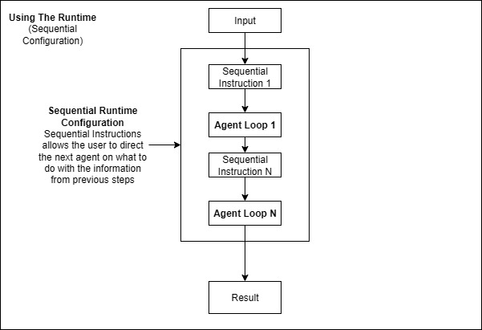

# Sequential Runtime

Sequential Runtime Configuration allows you to chain multiple agents together, where each agent processes the output of the previous agent in sequence.

## Overview

Sequential Runtime creates a pipeline of agents where:
- The first agent processes the initial user input
- Each subsequent agent processes the output from the previous agent
- The final agent's output is returned as the result



This pattern is perfect for multi-step processes like research → analysis → reporting workflows.

## Basic Sequential Configuration

### Simple Agent Chain

```csharp
using LlmTornado.Agents.ChatRuntime.RuntimeConfigurations;

// Create sequential agents
SequentialRuntimeAgent researchAgent = new SequentialRuntimeAgent(
    client: client,
    model: ChatModel.OpenAi.Gpt41.V41Mini,
    name: "Research Agent",
    instructions: """
        You are a research assistant. Search for information on the given topic
        and provide a comprehensive summary of your findings.
        """,
    sequentialInstructions: "Research the provided topic and provide a detailed summary."
);

SequentialRuntimeAgent analysisAgent = new SequentialRuntimeAgent(
    client: client,
    model: ChatModel.OpenAi.Gpt41.V41Mini,
    name: "Analysis Agent",
    instructions: """
        You are an analyst. Take research findings and identify key trends,
        patterns, and insights. Provide actionable analysis.
        """,
    sequentialInstructions: "Analyze the research findings and identify key insights."
);

SequentialRuntimeAgent reportAgent = new SequentialRuntimeAgent(
    client: client,
    model: ChatModel.OpenAi.Gpt41.V41Mini,
    name: "Report Agent",
    instructions: """
        You are a report writer. Create professional, well-structured reports
        based on analysis and research data.
        """,
    sequentialInstructions: "Create a professional report based on the analysis."
);

// Create sequential configuration
SequentialRuntimeConfiguration sequentialConfig = new SequentialRuntimeConfiguration([
    researchAgent,
    analysisAgent,
    reportAgent
]);

// Create and run runtime
ChatRuntime runtime = new ChatRuntime(sequentialConfig);
ChatMessage result = await runtime.InvokeAsync(
    new ChatMessage(ChatMessageRoles.User, "Create a report on renewable energy trends")
);

Console.WriteLine(result.Content);
```

## Sequential Agent Features

### Sequential Instructions

Sequential agents have special instructions that control their behavior in the chain:

```csharp
SequentialRuntimeAgent agent = new SequentialRuntimeAgent(
    client: client,
    model: ChatModel.OpenAi.Gpt41.V41Mini,
    name: "Processor",
    instructions: "You are a data processor.", // Main instructions
    sequentialInstructions: "Process the data from the previous agent and enhance it." // Sequential-specific instructions
);
```

### Tool Integration in Sequential Agents

Add tools to sequential agents for enhanced capabilities:

```csharp
// Tool for web search
[Description("Search the web for information")]
public static async Task<string> WebSearch(string query)
{
    // Web search implementation
    return "Search results for: " + query;
}

// Research agent with web search capability
SequentialRuntimeAgent researchAgent = new SequentialRuntimeAgent(
    client: client,
    model: ChatModel.OpenAi.Gpt41.V41Mini,
    name: "Research Agent",
    instructions: "You are a research assistant with web search capabilities.",
    sequentialInstructions: "Research the topic thoroughly using web search.",
    tools: [WebSearch]
);
```

## Advanced Sequential Patterns

### Research → Analysis → Report Pipeline

Complete example of a research pipeline:

```csharp
// Research Agent with Web Search
SequentialRuntimeAgent researchAgent = new SequentialRuntimeAgent(
    client: client,
    model: ChatModel.OpenAi.Gpt41.V41Mini,
    name: "Research Agent",
    instructions: """
        You are a research assistant. Given a search term, you search the web for that term and
        produce a concise summary of the results. The summary must be 2-3 paragraphs and less than 300 
        words. Capture the main points. Write succinctly, no need to have complete sentences or good
        grammar. This will be consumed by someone synthesizing a report, so its vital you capture the 
        essence and ignore any fluff. Do not include any additional commentary other than the summary itself.
        """,
    sequentialInstructions: "Research the provided topic thoroughly and provide a summary.",
    tools: [WebSearch]
);

// Analysis Agent
SequentialRuntimeAgent analysisAgent = new SequentialRuntimeAgent(
    client: client,
    model: ChatModel.OpenAi.Gpt41.V41Mini,
    name: "Analysis Agent",
    instructions: """
        You are a business analyst. Take research summaries and identify:
        - Key trends and patterns
        - Market opportunities
        - Potential risks or challenges
        - Strategic implications
        Provide clear, actionable insights based on the research data.
        """,
    sequentialInstructions: "Analyze the research findings and provide strategic insights."
);

// Report Generation Agent
SequentialRuntimeAgent reportAgent = new SequentialRuntimeAgent(
    client: client,
    model: ChatModel.OpenAi.Gpt41.V41Mini,
    name: "Report Agent",
    instructions: """
        You are a senior researcher tasked with writing a cohesive report for a research query.
        You will be provided with the original query, and some initial research done by a research assistant.

        You should first come up with an outline for the report that describes the structure and flow of the report. 
        Then, generate the report and return that as your final output.

        The final output should be in markdown format, and it should be lengthy and detailed. Aim for 2-3 pages of content, at least 250 words.
        """,
    sequentialInstructions: "With the provided research and analysis, create a comprehensive report."
);

// Create configuration and runtime
SequentialRuntimeConfiguration config = new SequentialRuntimeConfiguration([
    researchAgent,
    analysisAgent,
    reportAgent
]);

ChatRuntime runtime = new ChatRuntime(config);
```

### Code Development Pipeline

Sequential workflow for code development:

```csharp
// Requirements Analysis Agent
SequentialRuntimeAgent requirementsAgent = new SequentialRuntimeAgent(
    client: client,
    model: ChatModel.OpenAi.Gpt41.V41Mini,
    name: "Requirements Analyst",
    instructions: """
        You analyze software requirements and break them down into clear,
        actionable specifications. Identify edge cases and technical considerations.
        """,
    sequentialInstructions: "Analyze the requirements and create detailed specifications."
);

// Code Generation Agent
SequentialRuntimeAgent codeAgent = new SequentialRuntimeAgent(
    client: client,
    model: ChatModel.OpenAi.Gpt41.V41Mini,
    name: "Code Generator",
    instructions: """
        You are a senior software developer. Generate clean, well-documented code
        based on specifications. Follow best practices and include error handling.
        """,
    sequentialInstructions: "Generate code based on the specifications provided."
);

// Code Review Agent
SequentialRuntimeAgent reviewAgent = new SequentialRuntimeAgent(
    client: client,
    model: ChatModel.OpenAi.Gpt41.V41Mini,
    name: "Code Reviewer",
    instructions: """
        You are a senior code reviewer. Review code for:
        - Correctness and functionality
        - Code quality and maintainability
        - Security considerations
        - Performance optimizations
        Provide specific suggestions for improvement.
        """,
    sequentialInstructions: "Review the generated code and provide feedback."
);

var codeDevConfig = new SequentialRuntimeConfiguration([
    requirementsAgent,
    codeAgent,
    reviewAgent
]);
```

### Content Creation Pipeline

Multi-stage content creation workflow:

```csharp
// Topic Research Agent
SequentialRuntimeAgent topicAgent = new SequentialRuntimeAgent(
    client: client,
    model: ChatModel.OpenAi.Gpt41.V41Mini,
    name: "Topic Researcher",
    instructions: "Research topics and gather relevant information for content creation.",
    sequentialInstructions: "Research the topic and gather comprehensive information."
);

// Content Outline Agent
SequentialRuntimeAgent outlineAgent = new SequentialRuntimeAgent(
    client: client,
    model: ChatModel.OpenAi.Gpt41.V41Mini,
    name: "Content Outliner",
    instructions: "Create detailed outlines for content based on research.",
    sequentialInstructions: "Create a detailed content outline based on the research."
);

// Content Writer Agent
SequentialRuntimeAgent writerAgent = new SequentialRuntimeAgent(
    client: client,
    model: ChatModel.OpenAi.Gpt41.V41Mini,
    name: "Content Writer",
    instructions: "Write engaging, well-structured content based on outlines.",
    sequentialInstructions: "Write the content based on the provided outline."
);

// Content Editor Agent
SequentialRuntimeAgent editorAgent = new SequentialRuntimeAgent(
    client: client,
    model: ChatModel.OpenAi.Gpt41.V41Mini,
    name: "Content Editor",
    instructions: "Edit and refine content for clarity, flow, and engagement.",
    sequentialInstructions: "Edit and improve the content for final publication."
);

var contentConfig = new SequentialRuntimeConfiguration([
    topicAgent,
    outlineAgent,
    writerAgent,
    editorAgent
]);
```

## Event Handling and Monitoring

Monitor sequential agent execution:

```csharp
ValueTask HandleSequentialEvents(ChatRuntimeEvents runtimeEvent)
{
    switch (runtimeEvent.EventType)
    {
        case ChatRuntimeEventTypes.AgentStarted:
            Console.WriteLine($"\\n🚀 Starting: {runtimeEvent.AgentName}");
            break;
            
        case ChatRuntimeEventTypes.AgentCompleted:
            Console.WriteLine($"✅ Completed: {runtimeEvent.AgentName}");
            break;
            
        case ChatRuntimeEventTypes.StreamingOutput:
            if (runtimeEvent is ChatRuntimeStreamingEvent streamEvent)
            {
                Console.Write(streamEvent.Content);
            }
            break;
            
        case ChatRuntimeEventTypes.SequentialProgress:
            if (runtimeEvent is ChatRuntimeSequentialProgressEvent progressEvent)
            {
                Console.WriteLine($"Progress: {progressEvent.CurrentStep}/{progressEvent.TotalSteps}");
            }
            break;
    }
    return ValueTask.CompletedTask;
}

runtime.OnRuntimeEvent = HandleSequentialEvents;
```

## Streaming in Sequential Workflows

Enable streaming for real-time output:

```csharp
// Create streaming sequential agents
SequentialRuntimeAgent streamingAgent1 = new SequentialRuntimeAgent(
    client: client,
    model: ChatModel.OpenAi.Gpt41.V41Mini,
    name: "Agent 1",
    instructions: "You are the first agent in the chain.",
    sequentialInstructions: "Process the input and pass to the next agent.",
    streaming: true  // Enable streaming
);

SequentialRuntimeAgent streamingAgent2 = new SequentialRuntimeAgent(
    client: client,
    model: ChatModel.OpenAi.Gpt41.V41Mini,
    name: "Agent 2",
    instructions: "You are the second agent in the chain.",
    sequentialInstructions: "Enhance the output from the previous agent.",
    streaming: true  // Enable streaming
);

var streamingConfig = new SequentialRuntimeConfiguration([
    streamingAgent1,
    streamingAgent2
]);

// Handle streaming output
ValueTask HandleStreaming(ChatRuntimeEvents runtimeEvent)
{
    if (runtimeEvent is ChatRuntimeStreamingEvent streamEvent)
    {
        Console.Write($"[{streamEvent.AgentName}] {streamEvent.Content}");
    }
    return ValueTask.CompletedTask;
}

runtime.OnRuntimeEvent = HandleStreaming;
```

## Error Handling in Sequential Workflows

Handle errors gracefully in sequential chains:

```csharp
public class RobustSequentialRuntimeConfiguration : IRuntimeConfiguration
{
    public CancellationTokenSource cts { get; set; }
    
    private readonly List<SequentialRuntimeAgent> _agents;
    private readonly bool _continueOnError;
    
    public RobustSequentialRuntimeConfiguration(
        List<SequentialRuntimeAgent> agents, 
        bool continueOnError = false)
    {
        _agents = agents;
        _continueOnError = continueOnError;
    }
    
    public async Task<ChatMessage> InvokeAsync(
        ChatMessage input, 
        Func<ChatRuntimeEvents, ValueTask>? onRuntimeEvent = null)
    {
        ChatMessage currentMessage = input;
        
        for (int i = 0; i < _agents.Count; i++)
        {
            try
            {
                currentMessage = await _agents[i].InvokeAsync(currentMessage, onRuntimeEvent);
            }
            catch (Exception ex) when (_continueOnError && i < _agents.Count - 1)
            {
                // Log error and continue with original message
                if (onRuntimeEvent != null)
                {
                    await onRuntimeEvent(new ChatRuntimeErrorEvent(
                        $"Agent {_agents[i].Name} failed: {ex.Message}",
                        _agents[i].Name
                    ));
                }
                // Skip failed agent, continue with previous message
            }
        }
        
        return currentMessage;
    }
}
```

## Performance Optimization

### Parallel Pre-processing

Pre-process some stages in parallel when possible:

```csharp
public class OptimizedSequentialConfiguration : IRuntimeConfiguration
{
    public CancellationTokenSource cts { get; set; }
    
    private readonly List<SequentialRuntimeAgent> _sequentialAgents;
    private readonly List<SequentialRuntimeAgent> _parallelPreprocessors;
    
    public async Task<ChatMessage> InvokeAsync(
        ChatMessage input, 
        Func<ChatRuntimeEvents, ValueTask>? onRuntimeEvent = null)
    {
        // Run parallel preprocessors
        var parallelTasks = _parallelPreprocessors.Select(agent => 
            agent.InvokeAsync(input, onRuntimeEvent));
        var parallelResults = await Task.WhenAll(parallelTasks);
        
        // Combine parallel results
        var combinedInput = new ChatMessage(ChatMessageRoles.User, 
            $"Original: {input.Content}\\n" +
            $"Analysis: {string.Join("\\n", parallelResults.Select(r => r.Content))}");
        
        // Run sequential chain
        ChatMessage current = combinedInput;
        foreach (var agent in _sequentialAgents)
        {
            current = await agent.InvokeAsync(current, onRuntimeEvent);
        }
        
        return current;
    }
}
```

## Best Practices

### Agent Design

1. **Clear Roles**: Each agent should have a distinct, well-defined role
2. **Focused Instructions**: Keep instructions specific to each agent's purpose
3. **Output Format**: Ensure each agent produces output suitable for the next
4. **Error Handling**: Plan for failures at each stage

### Chain Design

1. **Logical Flow**: Design chains that follow natural progression
2. **Minimal Steps**: Avoid unnecessary intermediate steps
3. **Validation**: Validate output at each stage when critical
4. **Flexibility**: Allow for alternative paths when needed

### Performance

1. **Streaming**: Use streaming for long chains to provide immediate feedback
2. **Caching**: Cache intermediate results when appropriate
3. **Parallelization**: Pre-process independent tasks in parallel
4. **Resource Management**: Monitor token usage across the chain

## Common Use Cases

### Document Processing Pipeline
1. Extract → Analyze → Summarize → Format

### Research Workflow
1. Search → Filter → Analyze → Report

### Code Development
1. Requirements → Design → Implement → Review

### Content Creation
1. Research → Outline → Write → Edit

## Troubleshooting

### Common Issues

**Agent Chain Breaks**
```
Error: Agent failed to process previous output
```
Solution: Ensure each agent can handle the output format from the previous agent.

**Context Loss**
```
Error: Later agents lose important context
```
Solution: Include context preservation in sequential instructions.

**Performance Issues**
```
Error: Chain takes too long to complete
```
Solution: Optimize individual agents, consider parallel processing where possible.

## Next Steps

- Learn about [Handoff Runtime](handoff-runtime.md) for dynamic agent switching
- Explore [Orchestration Runtime](orchestration-runtime.md) for complex state machines
- Check [Examples](examples/) for complete sequential implementations
- Review [Best Practices](best-practices.md) for production deployments