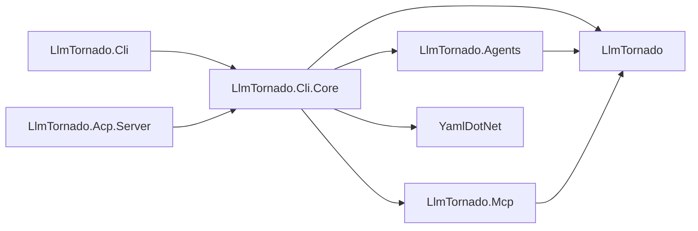
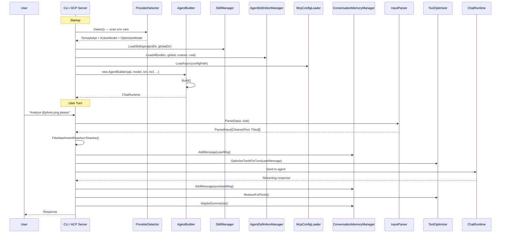
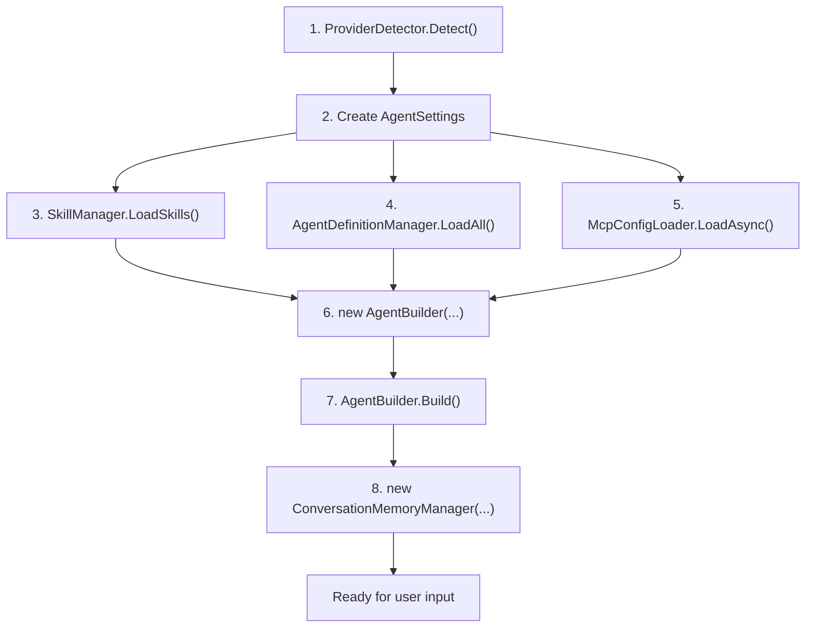

# 01 — Architecture Overview

## What is LlmTornado.Cli.Core?

**LlmTornado.Cli.Core** is a shared library (`net8.0`) that provides the core infrastructure for both the **Tornado CLI** and the **ACP Server**. It handles:

- Agent orchestration and persona management
- Skill discovery, activation, and script execution
- MCP (Model Context Protocol) tool integration
- Conversation memory with automatic summarization
- LLM provider auto-detection
- User input parsing with multimodal file attachments
- Per-turn tool optimization

The library is designed so that front-ends only need to provide thin adapter layers (e.g., `IToolApproval` for interactive prompts vs. auto-approval, `ISettingsPersistence` for disk vs. no-op persistence).

## Project Dependencies



| Dependency | Purpose |
|---|---|
| `LlmTornado` | Core LLM API client, chat models, tool definitions |
| `LlmTornado.Agents` | `TornadoAgent`, `ChatRuntime`, runtime configurations |
| `LlmTornado.Mcp` | `MCPServer` for stdio/HTTP MCP protocol support |
| `YamlDotNet` | YAML frontmatter parsing for skill and persona files |

## Folder Structure

```
LlmTornado.Cli.Core/
├── AgentBuilder.cs            # Central orchestrator
├── AgentSettings.cs           # Serializable user preferences
├── ISettingsPersistence.cs    # Persistence abstraction
├── IToolApproval.cs           # Tool approval abstraction
│
├── Agents/                    # Agent persona system
│   ├── AgentDefinition.cs         # Persona data model
│   ├── AgentDefinitionLoader.cs   # Filesystem discovery & YAML parsing
│   ├── AgentDefinitionManager.cs  # Lifecycle & capability curation
│   └── built-in/                  # Built-in persona .md files
│       ├── default.md
│       ├── architect.md
│       ├── code-reviewer.md
│       ├── debugger.md
│       ├── docs-writer.md
│       └── planner.md
│
├── Input/                     # User input processing
│   ├── InputParser.cs             # @path token scanner
│   └── FileAttachmentResolver.cs  # File → ChatMessage conversion
│
├── Mcp/                       # MCP server integration
│   ├── McpConfigModel.cs         # Config data model
│   └── McpConfigLoader.cs        # JSON config loader & server lifecycle
│
├── Memory/                    # Conversation memory
│   ├── CompressionStrategy.cs        # Token-aware compression analysis
│   ├── MessageSummarizer.cs          # LLM-based summarization
│   ├── ConversationMemoryManager.cs  # Active conversation manager
│   └── ConversationStore.cs          # Named conversation CRUD (JSONL)
│
├── Providers/                 # LLM provider detection
│   ├── ProviderDetectionResult.cs    # Detection result model
│   └── ProviderDetector.cs           # Environment variable scanner
│
├── Skills/                    # Agent skills (agentskills.io)
│   ├── Skill.cs                  # Skill data model
│   ├── SkillLoader.cs            # Filesystem discovery & parsing
│   ├── SkillManager.cs           # Lifecycle management
│   └── ScriptToolBuilder.cs      # Script → Tool conversion with approval
│
└── Tools/                     # Tool optimization
    └── ToolOptimizer.cs          # LLM-based per-turn tool selection
```

## High-Level Data Flow



## Abstraction Interfaces

The library uses two key interfaces to decouple front-end concerns:

### `IToolApproval`

```csharp
public interface IToolApproval
{
    void PreApproveSkillTools(IEnumerable<string> toolNames);
    bool IsAutoApproved(string toolName);
    ValueTask<bool> HandleToolPermissionRequest(string requestMessage);
}
```

| Implementation | Behavior |
|---|---|
| **CLI** | Interactive prompt — asks the user in the terminal |
| **ACP Server** | Auto-approves all tools (headless operation) |

### `ISettingsPersistence`

```csharp
public interface ISettingsPersistence
{
    void SaveSettings(AgentSettings settings);
}
```

| Implementation | Behavior |
|---|---|
| **CLI** | Serializes to JSON on disk |
| **ACP Server** | No-op (settings are ephemeral per session) |

## Component Initialization Order


