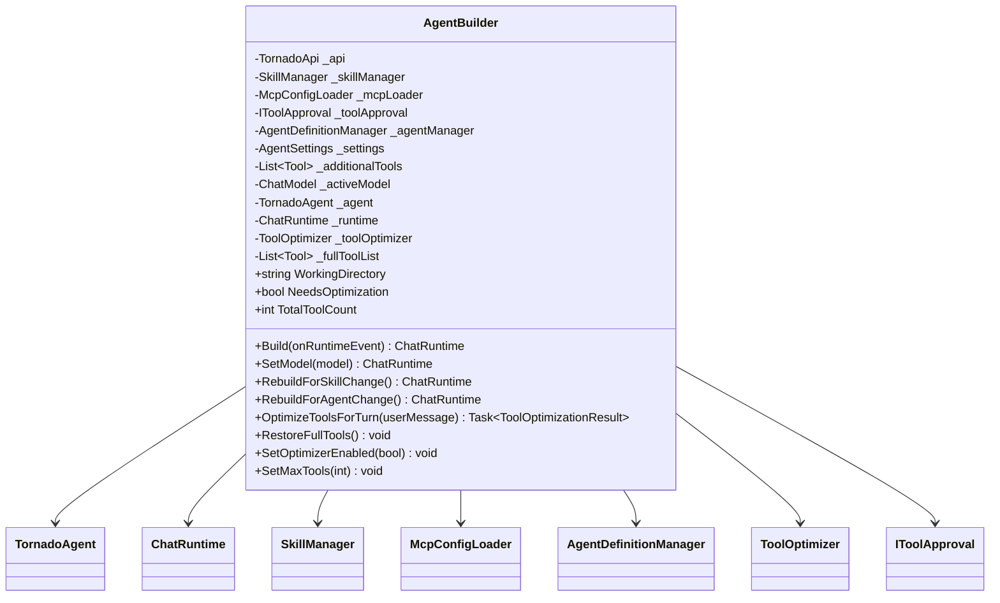
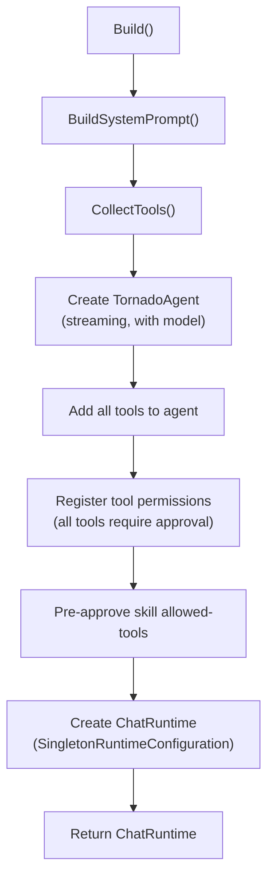
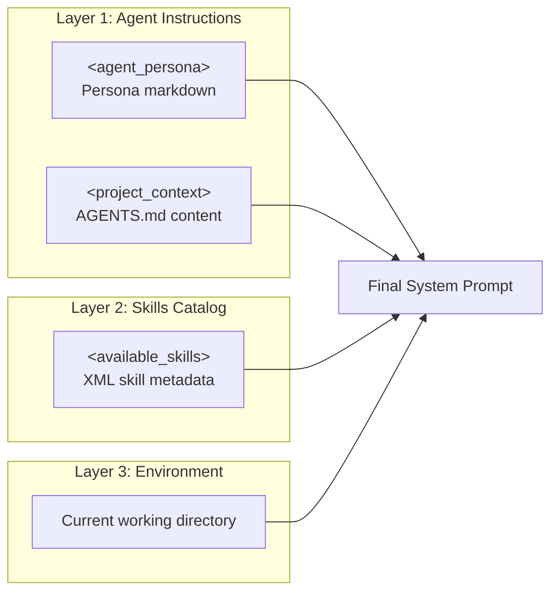
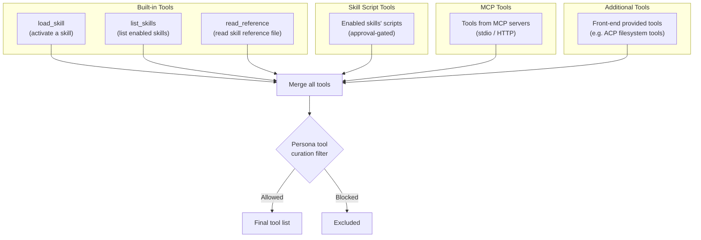
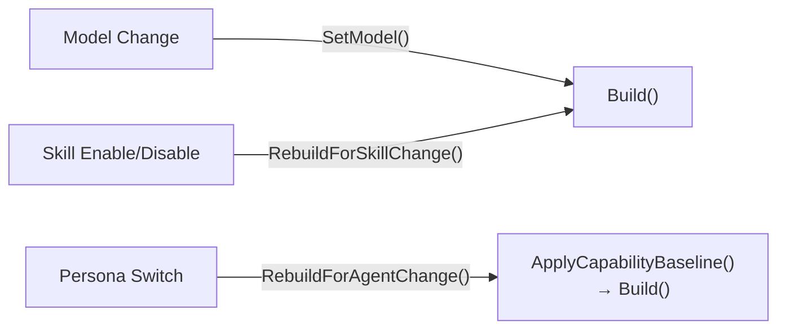
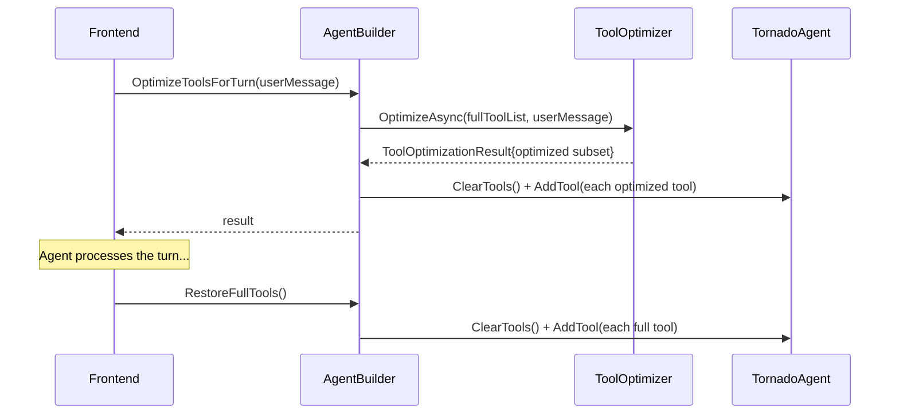

# 02 — AgentBuilder: Central Orchestrator

The `AgentBuilder` is the single entry point shared between the CLI and ACP Server. It assembles a `TornadoAgent` and `ChatRuntime` from all system components.

## Class Overview



## Build Process

The `Build()` method is the core operation. It can be called multiple times (e.g., after model change, skill toggle, or persona switch).



## System Prompt Assembly

The system prompt is built in layers:



### Example System Prompt Structure

```xml
<agent_persona>
You are an expert software architect...
(persona markdown from selected .md file)
</agent_persona>

<project_context>
This project uses .NET 8 and follows clean architecture...
(merged content from AGENTS.md files found in parent directories)
</project_context>

<available_skills>
  <skill>
    <name>file-analyzer</name>
    <description>Analyze file structure and content</description>
    <location>/path/to/skills/file-analyzer/SKILL.md</location>
    <scripts>tree-summary.py, line-count.sh</scripts>
  </skill>
</available_skills>

When a user's task matches a skill, use the `load_skill` tool to activate it.
The skill's full instructions will be returned and you should follow them.

The user's current working directory is: C:\Users\john\project
```

## Tool Collection

`CollectTools()` aggregates tools from all sources, then filters by the active persona's curation rules.



**Important**: The three built-in tools (`load_skill`, `list_skills`, `read_reference`) always pass the persona filter, regardless of whitelist/blacklist configuration.

## Built-in Tools

| Tool | Parameters | Description |
|------|-----------|-------------|
| `load_skill` | `skillName: string` | Loads a skill's full instructions on demand (progressive disclosure). Returns instructions text or error. |
| `list_skills` | *(none)* | Lists all enabled skills with descriptions, activation status, and available scripts. |
| `read_reference` | `skillName: string, relativePath: string` | Reads a file from a skill's directory. Path-traversal protected (must stay within skill dir). Output capped at 30KB. |

## Rebuild Scenarios

The agent can be rebuilt at runtime for several reasons:



`RebuildForAgentChange()` is special — it first applies the new persona's capability baseline (resetting all skills, then applying the persona's whitelist/blacklist) before rebuilding.

## Tool Optimization Flow (Per-Turn)

When the total tool count exceeds the configured threshold (default: 25), the optimizer runs on each user turn:



## Configuration Properties

The `AgentBuilder` respects these `AgentSettings` values:

| Setting | Default | Effect |
|---------|---------|--------|
| `ToolOptimizerEnabled` | `true` | Whether per-turn tool optimization is active |
| `MaxTools` | `25` | Tool count threshold that triggers optimization |
| `DisabledSkills` | `[]` | Skills excluded from tool collection |
| `ActiveAgent` | `null` | Persona name that controls capability curation |
