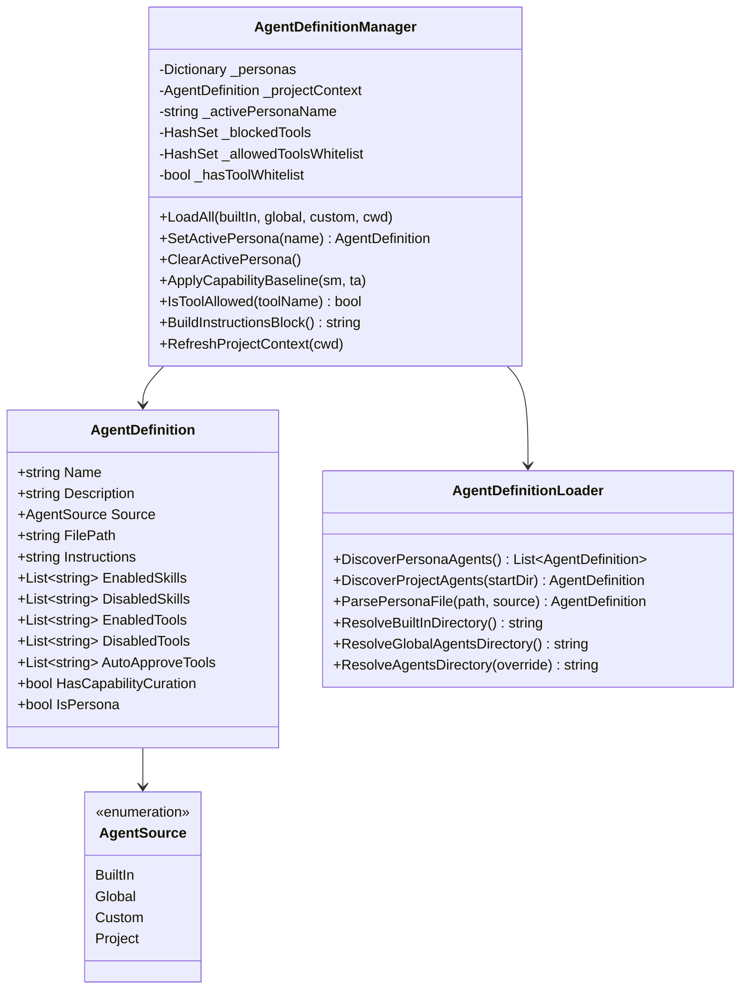
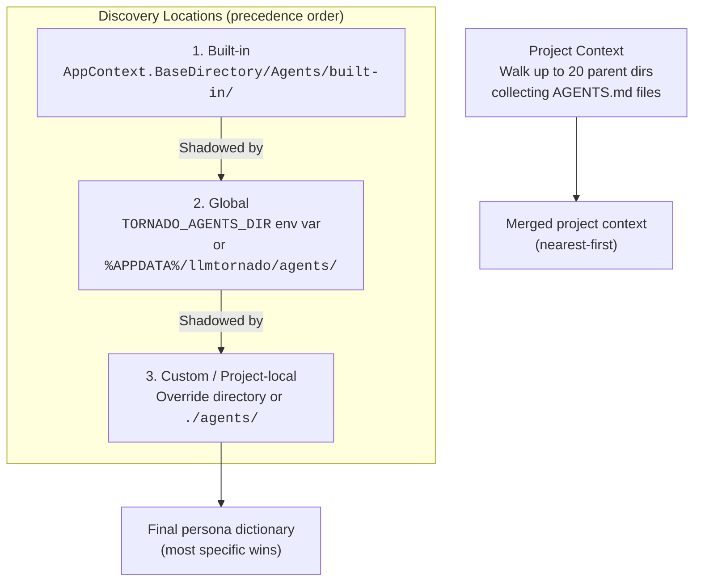
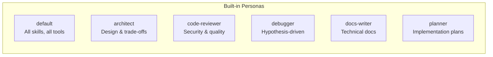
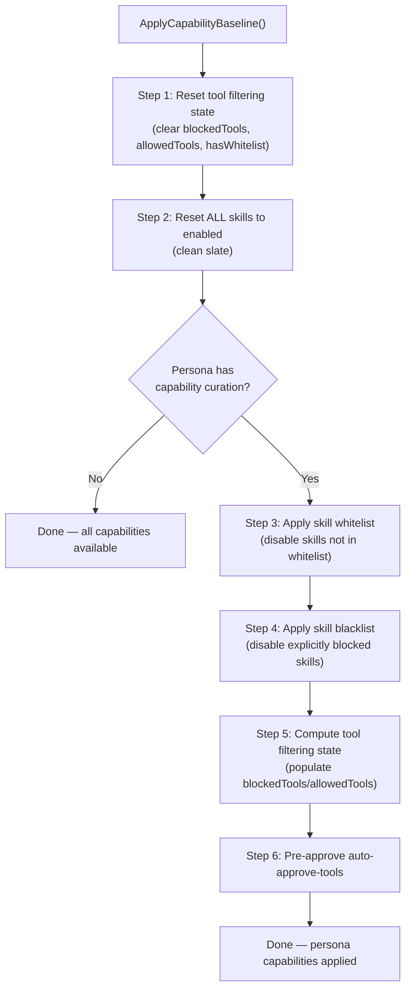
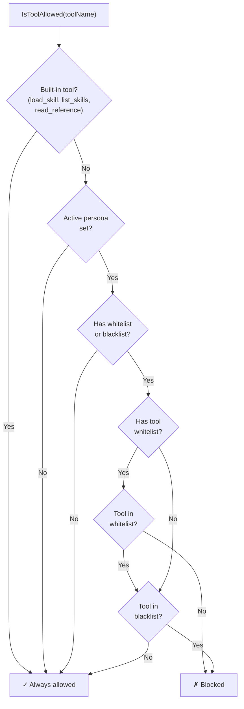
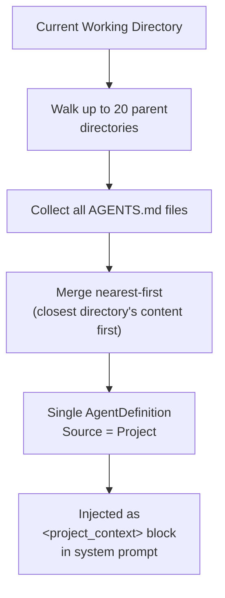

# 03 — Agent Persona System

The agent persona system lets users switch between specialized agent behaviors (e.g., "architect", "debugger") while maintaining per-persona control over which skills and tools are available.

## Architecture



## Agent Sources & Discovery

Persona agents are discovered from three filesystem locations. Each layer shadows the previous — if a persona with the same name exists in multiple locations, the most specific one wins.



### Directory Resolution

| Source | Resolution Logic |
|--------|-----------------|
| **Built-in** | `AppContext.BaseDirectory/Agents/built-in/` |
| **Global** | `TORNADO_AGENTS_DIR` env var → `%APPDATA%/llmtornado/agents/` |
| **Custom** | Settings override → `./agents/` |
| **Project** | Walk up from CWD, collect all `AGENTS.md`, merge nearest-first |

## Persona File Format

Each persona is a Markdown file with YAML frontmatter. The filename must be a valid slug (1–64 chars, lowercase alphanumeric + hyphens, no consecutive hyphens).

```markdown
---
name: architect
description: Software architecture and design trade-offs
enabled-skills: file-analyzer web-search
auto-approve-tools: file-analyzer:tree-summary file-analyzer:line-count
---

You are an expert software architect. Focus on:
- System design and architecture patterns
- Trade-off analysis between approaches
- Scalability and maintainability considerations

Always consider the project's existing patterns before suggesting changes.
```

### Frontmatter Fields

| Field | Type | Description |
|-------|------|-------------|
| `name` | string | Persona identifier (must match filename) |
| `description` | string | Short description shown in persona list |
| `enabled-skills` | space-delimited | Whitelist — only these skills are enabled |
| `disabled-skills` | space-delimited | Blacklist — these skills are disabled |
| `enabled-tools` | space-delimited | Whitelist — only these tools are available |
| `disabled-tools` | space-delimited | Blacklist — these tools are hidden |
| `auto-approve-tools` | space-delimited | Tools that skip the approval prompt |

### Validation Rules

- Filename: 1–64 chars, lowercase `[a-z0-9-]`, no consecutive hyphens, no leading/trailing hyphens
- Max file size: 100KB
- `name` must match the filename slug
- `description` max: 1024 chars
- Frontmatter parsed as simple `key: value` pairs with nested map support

## Built-in Personas



| Persona | Enabled Skills | Auto-Approved Tools | Special |
|---------|----------------|---------------------|---------|
| `default` | All | None | No capability curation |
| `architect` | `file-analyzer`, `web-search` | `file-analyzer:tree-summary`, `file-analyzer:line-count` | — |
| `code-reviewer` | `file-analyzer` | `file-analyzer:*` | Disables note-taker tools |
| `debugger` | `file-analyzer`, `web-search` | `file-analyzer:*` | — |
| `docs-writer` | `file-analyzer`, `note-taker` | `file-analyzer:*`, `note-taker:list`, `note-taker:search` | — |
| `planner` | `file-analyzer`, `web-search`, `note-taker` | Analysis + notes tools | Never writes code |

## Capability Baseline Application

When a persona is activated, `ApplyCapabilityBaseline()` executes a 5-step process:



## Tool Filtering Logic

After the capability baseline is applied, `IsToolAllowed()` checks each tool:



## Project Context (AGENTS.md)

Project context is separate from personas. It provides project-specific instructions that are always included in the system prompt (regardless of which persona is active).



The `ProjectAgentsEnabled` setting (default: `true`) controls whether AGENTS.md scanning is active.

## Instructions Block Assembly

`BuildInstructionsBlock()` combines persona + project context into XML blocks for the system prompt:

```xml
<agent_persona>
(Active persona's markdown instructions)
</agent_persona>

<project_context>
(Merged AGENTS.md content from parent directories)
</project_context>
```

If no persona is active, only the project context block is included (if found). If neither exists, the `AgentBuilder` falls back to a generic "You are a helpful assistant" prompt.
