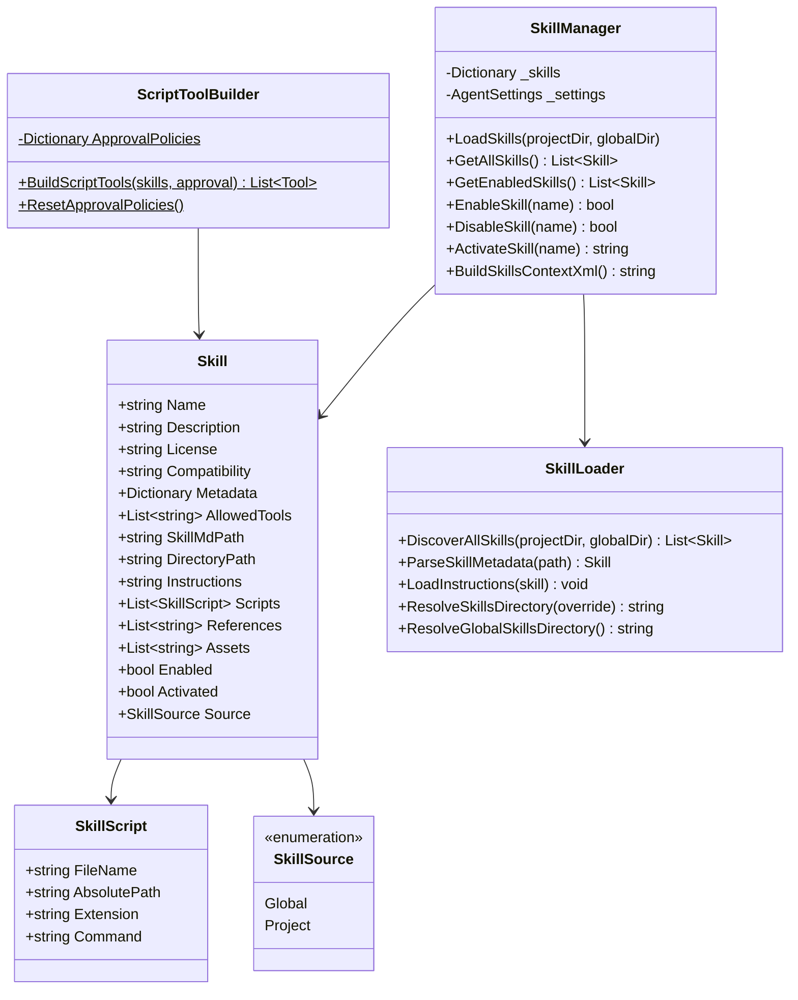
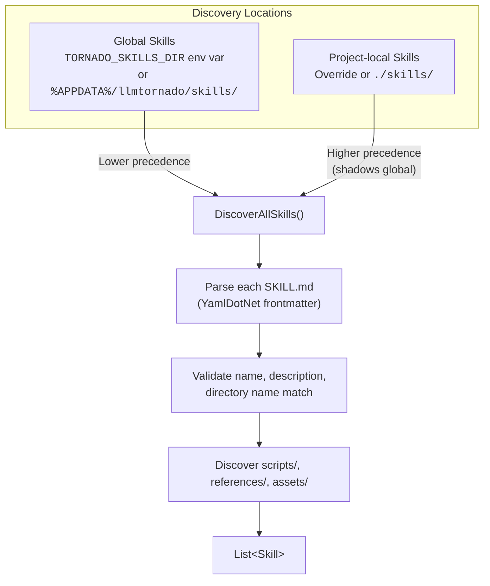
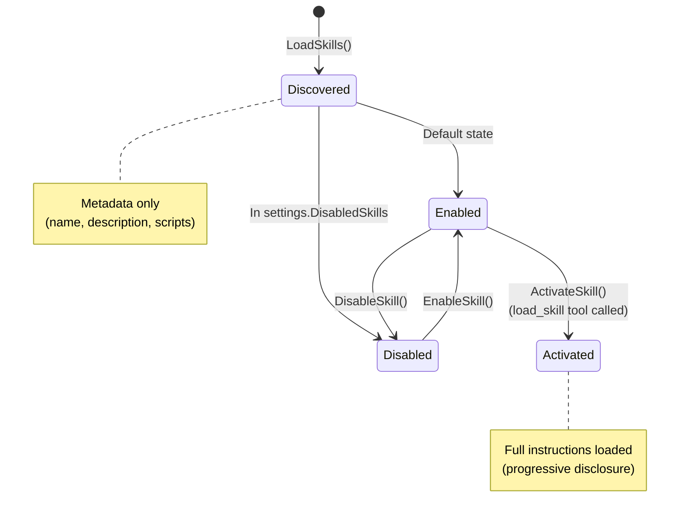
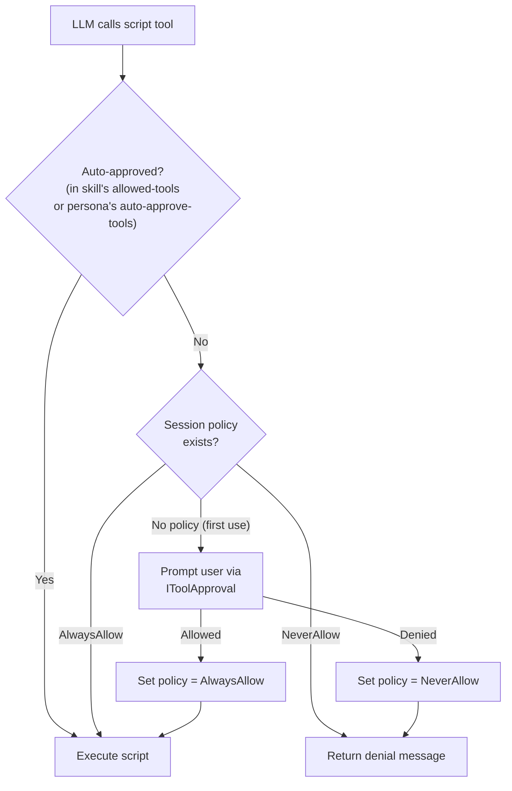
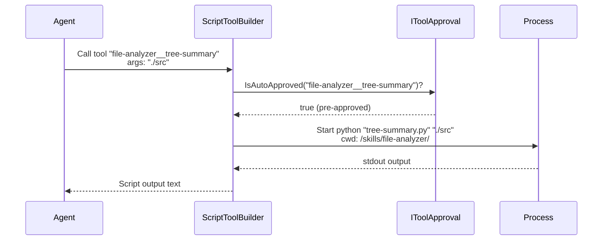
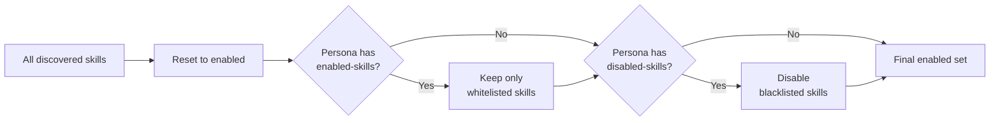

# 04 — Skills System

The skills system follows the [agentskills.io](https://agentskills.io) standard. Skills are self-contained packages that provide specialized knowledge and executable scripts to the agent, loaded on-demand (progressive disclosure).

## Architecture



## Skill Directory Layout

Each skill lives in its own directory with a `SKILL.md` file and optional subdirectories:

```
skills/
├── file-analyzer/
│   ├── SKILL.md                 # Frontmatter + instructions
│   ├── scripts/
│   │   ├── tree-summary.py      # Executable scripts
│   │   └── line-count.sh
│   ├── references/
│   │   └── patterns.md          # Reference docs (readable via tool)
│   └── assets/
│       └── config.json          # Static assets
│
├── web-search/
│   ├── SKILL.md
│   └── scripts/
│       └── search.py
│
└── note-taker/
    ├── SKILL.md
    └── scripts/
        ├── create.py
        ├── list.py
        └── search.py
```

## SKILL.md Format

```markdown
---
name: file-analyzer
description: Analyze file structure, content patterns, and codebase metrics
license: MIT
compatibility: Cross-platform, requires Python 3.8+
allowed-tools: file-analyzer__tree-summary file-analyzer__line-count
---

## Instructions

When analyzing files, follow these steps:
1. Use tree-summary to get an overview of the directory structure
2. Identify key files based on naming conventions and structure
3. Use line-count for quantitative analysis when needed
...
```

### Frontmatter Fields

| Field | Required | Max Length | Description |
|-------|----------|-----------|-------------|
| `name` | Yes | 64 chars | Must match directory name; lowercase `[a-z0-9-]` |
| `description` | Yes | 1024 chars | Shown in skill catalog |
| `license` | No | — | License identifier |
| `compatibility` | No | 500 chars | Platform/dependency requirements |
| `allowed-tools` | No | — | Space-delimited tool names to pre-approve |
| `metadata` | No | — | Arbitrary key-value pairs |

## Discovery & Loading



### Script Interpreter Detection

| Extension | Interpreter Command |
|-----------|-------------------|
| `.py` | `python` |
| `.sh` | `bash` |
| `.ps1` | `pwsh` |
| `.js` | `node` |
| `.ts` | `npx tsx` |
| `.rb` | `ruby` |

## Skill Lifecycle



### Progressive Disclosure

Skills use a two-phase loading approach to keep the system prompt compact:

1. **Phase 1 — Discovery**: Only metadata (name, description, scripts list) is loaded and included in the system prompt as an XML catalog
2. **Phase 2 — Activation**: When the LLM calls `load_skill`, the full markdown instructions are loaded from disk and returned

This means the system prompt grows only when skills are actually needed.

```mermaid
sequenceDiagram
    participant User
    participant Agent as LLM Agent
    participant SM as SkillManager

    Note over Agent: System prompt contains:<br/>&lt;available_skills&gt;<br/>  file-analyzer: Analyze file structure...<br/>&lt;/available_skills&gt;

    User->>Agent: "Analyze my project structure"
    Agent->>SM: load_skill("file-analyzer")
    SM->>SM: LoadInstructions(skill)<br/>(reads SKILL.md body from disk)
    SM-->>Agent: Full instructions markdown
    Note over Agent: Agent now has detailed<br/>instructions for file analysis
    Agent->>User: "I'll analyze your project..."
```

## Skills Context XML

`BuildSkillsContextXml()` generates the XML catalog injected into the system prompt:

```xml
<available_skills>
  <skill>
    <name>file-analyzer</name>
    <description>Analyze file structure, content patterns, and codebase metrics</description>
    <location>/path/to/skills/file-analyzer/SKILL.md</location>
    <scripts>tree-summary.py, line-count.sh</scripts>
  </skill>
  <skill>
    <name>web-search</name>
    <description>Search the web for current information</description>
    <location>/path/to/skills/web-search/SKILL.md</location>
    <scripts>search.py</scripts>
  </skill>
</available_skills>
```

## Script Tool Execution

`ScriptToolBuilder` converts skill scripts into LLM-callable `Tool` instances with a full approval system.

### Tool Naming Convention

Script tools are named: `{skill-name}__{script-name-without-extension}`

Example: `file-analyzer/scripts/tree-summary.py` → tool name `file-analyzer__tree-summary`

### Approval Flow



### Script Execution Details

| Property | Value |
|----------|-------|
| Timeout | 5 minutes |
| Output cap | 30KB (truncated with `[OUTPUT TRUNCATED]`) |
| Process | Spawned with detected interpreter |
| Working directory | Skill's directory |
| Output | stdout + stderr (prefixed with `[stderr]`) |
| Shell | `UseShellExecute = false`, `CreateNoWindow = true` |



## Interaction with Personas

Personas can curate which skills are available. When a persona is activated:

1. All skills are reset to enabled (clean slate)
2. If the persona has `enabled-skills`, only those are kept enabled
3. If the persona has `disabled-skills`, those are additionally disabled
4. The persona's `auto-approve-tools` are pre-approved for the session


