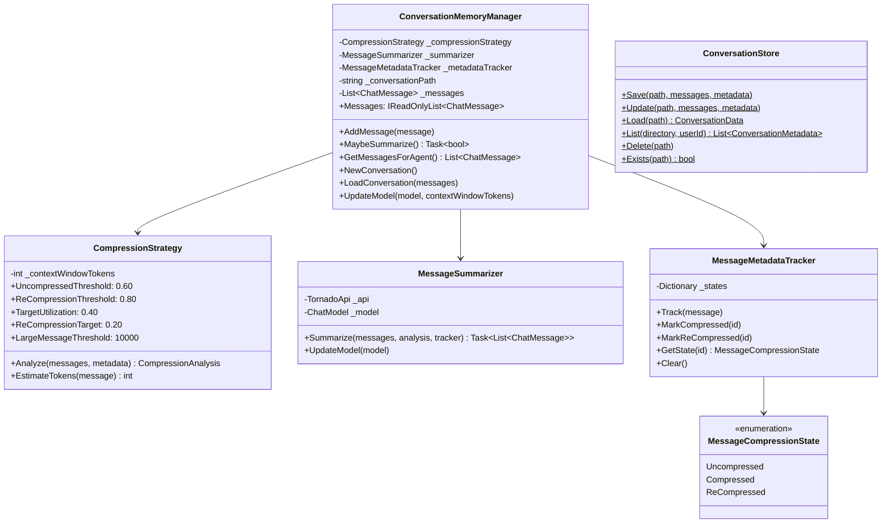
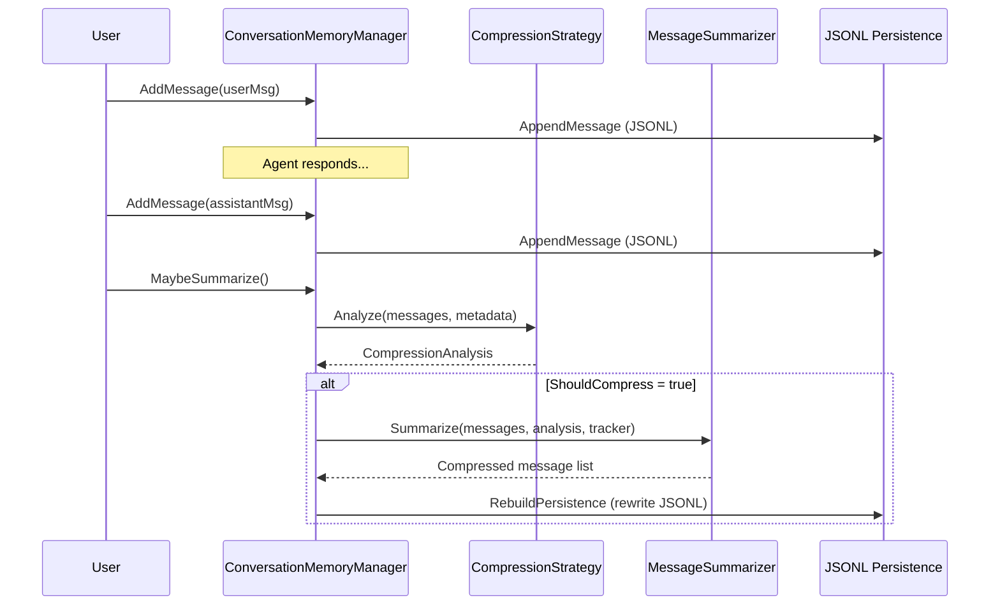
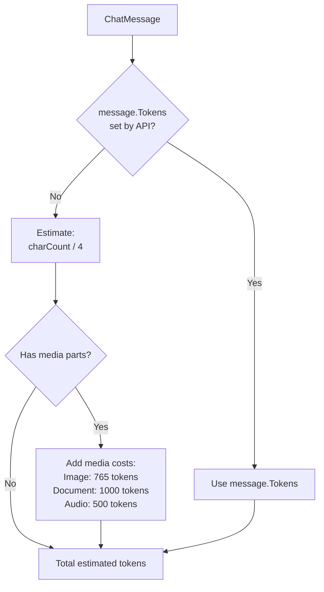
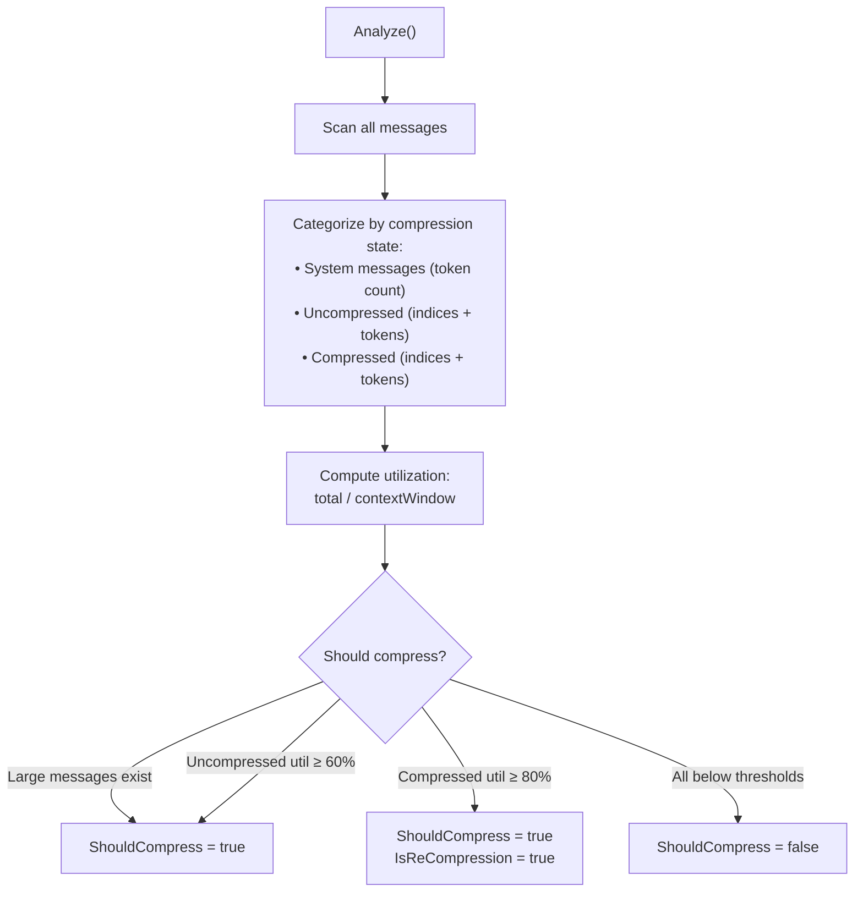
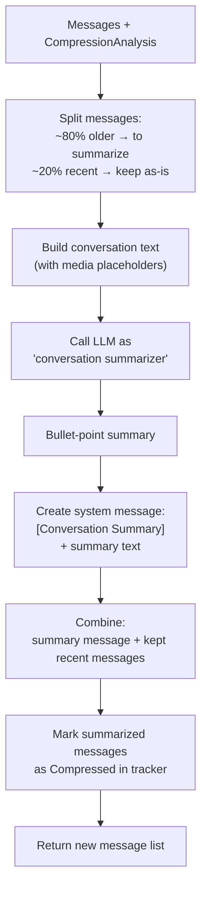
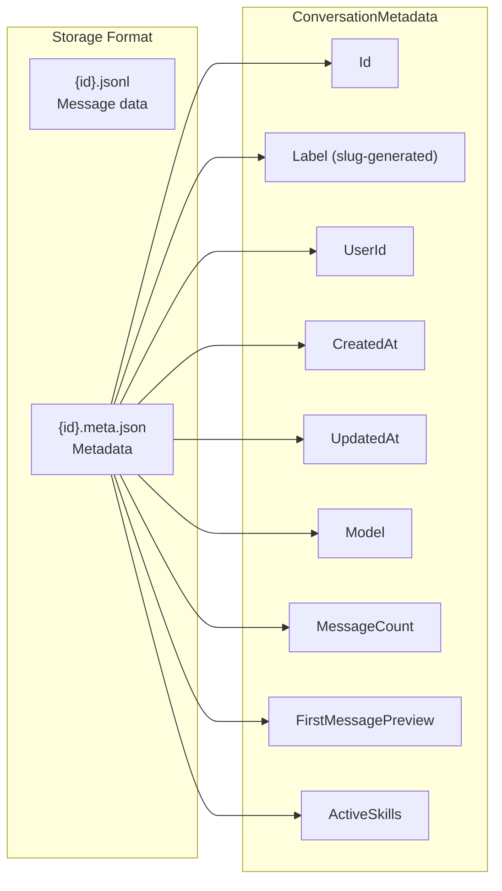
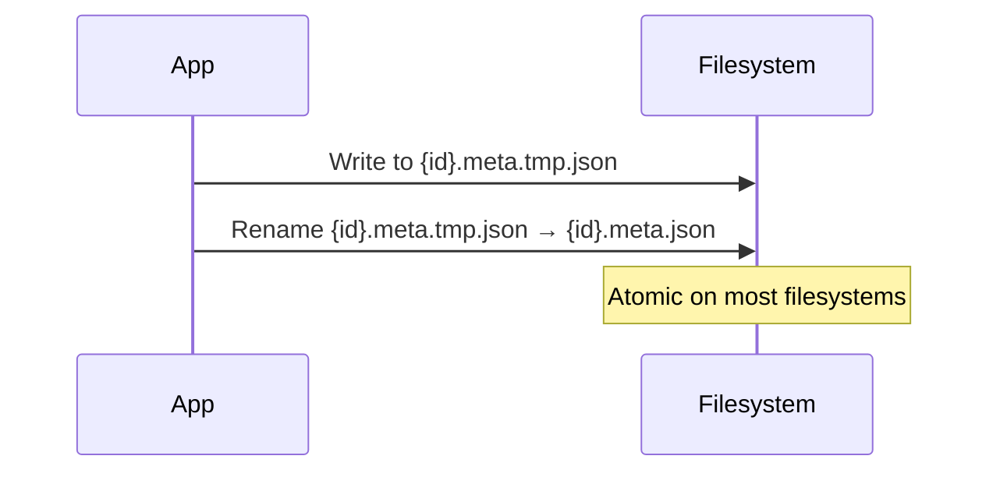
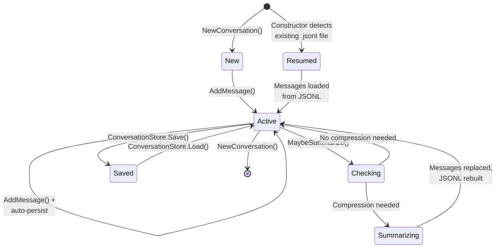

# 05 — Conversation Memory System

The memory system manages conversation history with automatic token-aware compression, LLM-based summarization, and crash-resilient JSONL persistence.

## Architecture



## Overall Flow



## Compression Strategy

The `CompressionStrategy` analyzes the conversation to decide when summarization is needed. It works with configurable token utilization thresholds.

### Thresholds

| Threshold | Default | Meaning |
|-----------|---------|---------|
| `UncompressedThreshold` | 60% | Trigger first compression when uncompressed messages use >60% of context window |
| `ReCompressionThreshold` | 80% | Trigger re-compression when already-compressed + system messages use >80% |
| `TargetUtilization` | 40% | After first compression, aim for 40% utilization |
| `ReCompressionTarget` | 20% | After re-compression, aim for 20% utilization |
| `LargeMessageThreshold` | 10,000 tokens | Individual messages above this always trigger compression |

### Token Estimation



### Compression Analysis



### Media Token Cost Reference

| Media Type | Token Cost | Notes |
|------------|-----------|-------|
| Image (low detail) | 85 | Rarely used in estimates |
| Image (high/auto) | 765 | Conservative default |
| Document (PDF) | 1,000 | Per page estimate |
| Audio | 500 | Per attachment |

## Message Summarization

`MessageSummarizer` uses an LLM to compress conversation history into bullet-point summaries.

### Summarization Process



### Media Placeholders

When building the conversation text for the LLM summarizer, media attachments are replaced with descriptive placeholders:

| Media Type | Placeholder |
|------------|-------------|
| Image | `[image attached]` |
| Document | `[document attached]` |
| Audio | `[audio attached]` |

### Summary Output Format

The summarizer produces a system message that replaces the compressed conversation turns:

```
[Conversation Summary]
- User asked about project architecture and was given an overview of the microservices design
- File analysis revealed 3 services: auth, api-gateway, and user-service
- User requested security review of auth service, found 2 potential issues with JWT handling
- Discussed migration plan from monolith to microservices with phased approach
```

## Persistence

### JSONL Format (Crash-Resilient)

Each message is appended as a single JSON line to a `.jsonl` file:

```jsonl
{"role":"user","content":"Analyze my project","id":"abc-123","timestamp":"2026-03-01T10:00:00Z"}
{"role":"assistant","content":"I'll analyze your project structure...","id":"def-456","timestamp":"2026-03-01T10:00:05Z"}
```

**Append-only**: New messages are appended immediately via `PersistentConversation.AppendMessage()`. This means if the process crashes, all messages up to the last complete line are recoverable.

**Rebuild**: After summarization, the entire file is rewritten with the compressed message list.

### Conversation Store (Named Conversations)

`ConversationStore` provides CRUD operations for named/labeled conversations:



| Operation | Description |
|-----------|-------------|
| `Save` | Auto-generates ID or uses caller-provided; creates `.jsonl` + `.meta.json` |
| `Update` | Atomic write via temp file + rename |
| `List` | Scans directory for `.meta.json` files, optional userId filter, sorted newest-first |
| `Load` | Reads both files, returns messages + metadata |
| `Delete` | Removes both files |

### Atomic Writes

Updates use a temp-file-then-rename pattern for crash safety:



## Conversation Lifecycle



## Configuration

| Setting | Default | Description |
|---------|---------|-------------|
| `MaxTurnsBeforeSummary` | *(in AgentSettings)* | Hint for when to check summarization |
| Context window | 128,000 tokens | Default if not specified by model |

The compression strategy dynamically adapts to the model's context window size. When `UpdateModel()` is called after a model switch, the context window is updated accordingly.
