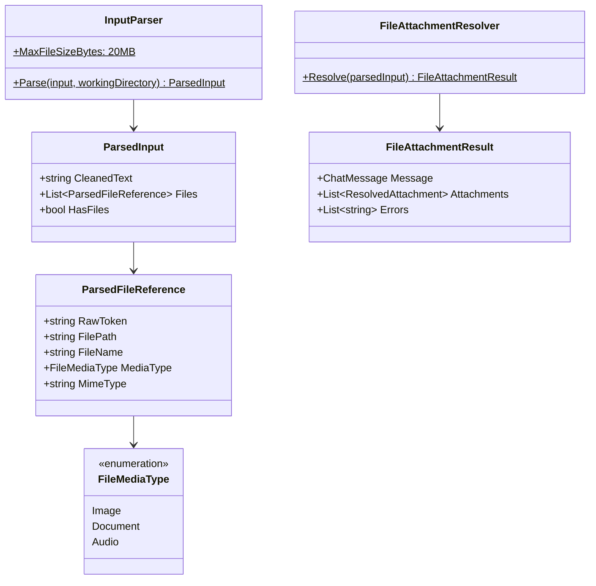
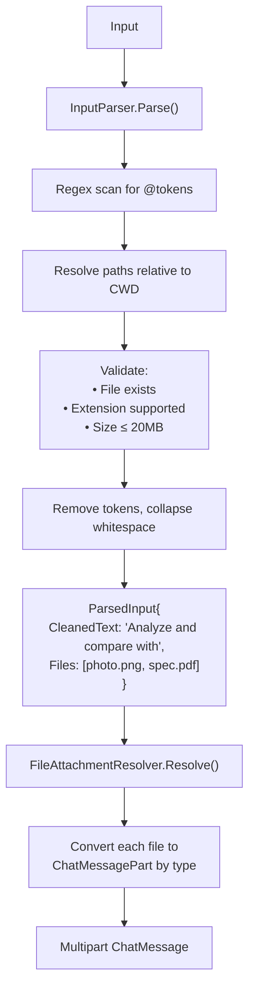
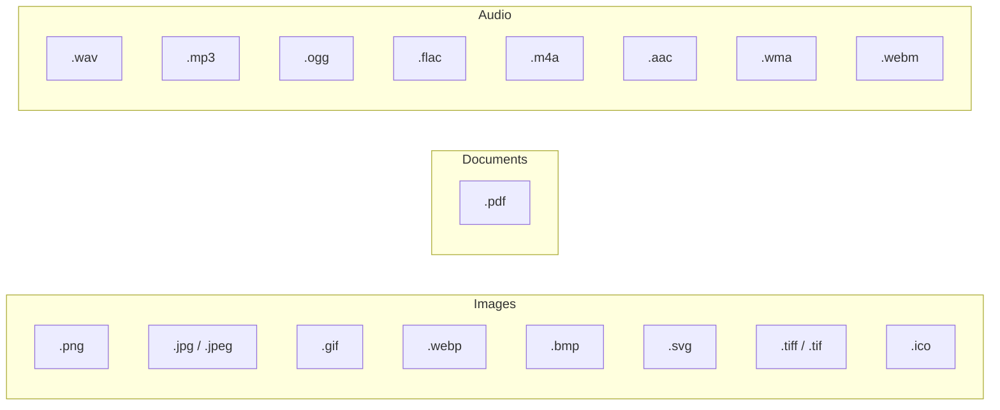
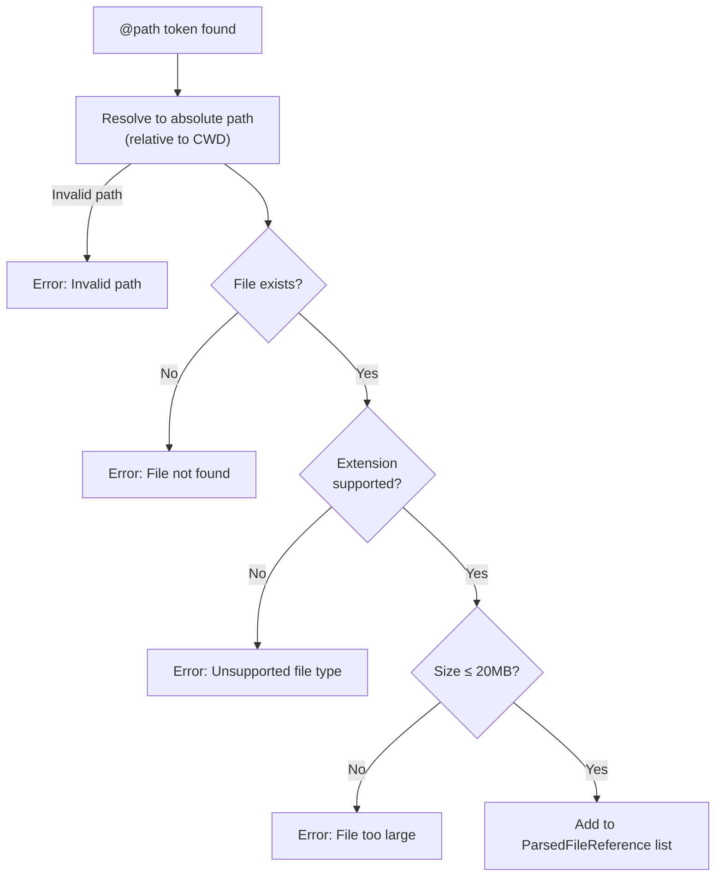
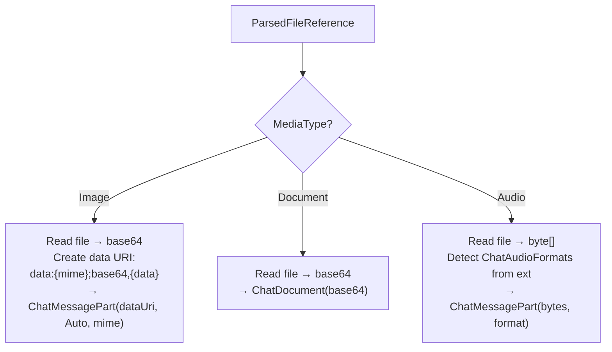
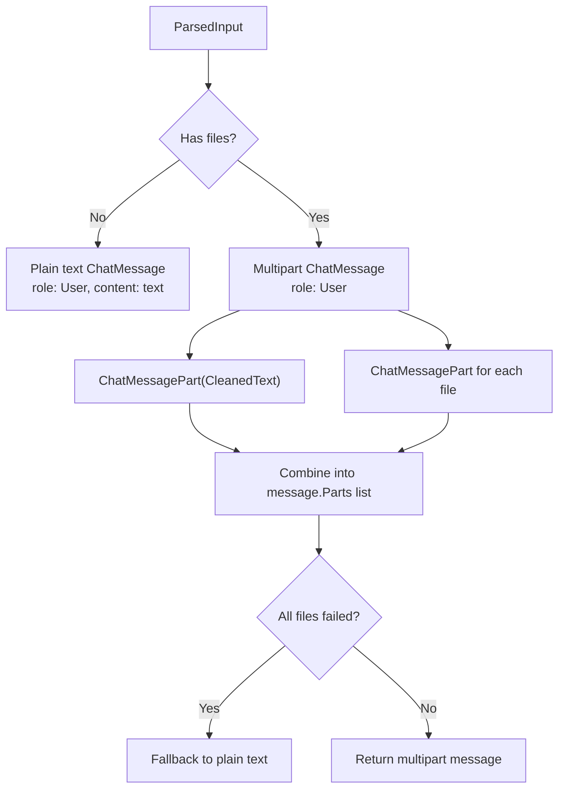

# 06 — Input Processing

The input processing pipeline scans user text for inline file references (`@path`), resolves them against the filesystem, and converts them into multimodal `ChatMessage` instances.

## Architecture



## End-to-End Flow



## Input Parser

### Token Syntax

The parser recognizes two `@path` formats:

| Format | Example | Notes |
|--------|---------|-------|
| `@unquoted/path` | `@photo.png`, `@./src/main.py` | No spaces allowed in path |
| `@"quoted path"` | `@"my documents/photo.png"` | Spaces allowed inside quotes |

**Regex pattern**: `@"([^"]+)"|@(\S+)`

### Supported File Types



### Validation Rules



### Text Cleaning

After extracting file tokens, the parser:
1. Removes each `@token` from the original text (processed in reverse order to preserve string indices)
2. Collapses multiple consecutive spaces into single spaces
3. Trims leading/trailing whitespace

**Example**:
- Input: `"Analyze @photo.png and compare with @"./spec.pdf" please"`
- CleanedText: `"Analyze and compare with please"`

## File Attachment Resolution

`FileAttachmentResolver` converts `ParsedInput` into a `ChatMessage` suitable for the LLM.

### Conversion by Media Type



### Message Construction



### MIME Type Mapping

| Extension | MIME Type |
|-----------|----------|
| `.png` | `image/png` |
| `.jpg`, `.jpeg` | `image/jpeg` |
| `.gif` | `image/gif` |
| `.webp` | `image/webp` |
| `.bmp` | `image/bmp` |
| `.svg` | `image/svg+xml` |
| `.tiff`, `.tif` | `image/tiff` |
| `.ico` | `image/x-icon` |
| `.pdf` | `application/pdf` |
| `.wav` | `audio/wav` |
| `.mp3` | `audio/mpeg` |
| `.ogg` | `audio/ogg` |
| `.flac` | `audio/flac` |
| `.m4a` | `audio/mp4` |
| `.aac` | `audio/aac` |
| `.wma` | `audio/x-ms-wma` |
| `.webm` | `audio/webm` |

## Example Pipeline

```mermaid
sequenceDiagram
    participant User
    participant IP as InputParser
    participant FAR as FileAttachmentResolver
    participant Agent as ChatRuntime

    User->>IP: "What's in @screenshot.png?"
    IP->>IP: Regex match: @screenshot.png
    IP->>IP: Resolve: C:\project\screenshot.png
    IP->>IP: Validate: exists ✓, .png ✓, 2MB ✓
    IP-->>FAR: ParsedInput{<br/>CleanedText: "What's in?",<br/>Files: [{screenshot.png, Image, image/png}]}

    FAR->>FAR: Read screenshot.png → base64
    FAR->>FAR: Create ChatMessagePart<br/>(data:image/png;base64,...)
    FAR-->>Agent: ChatMessage{<br/>Role: User,<br/>Parts: [text, image]}

    Agent-->>User: "The screenshot shows..."
```
