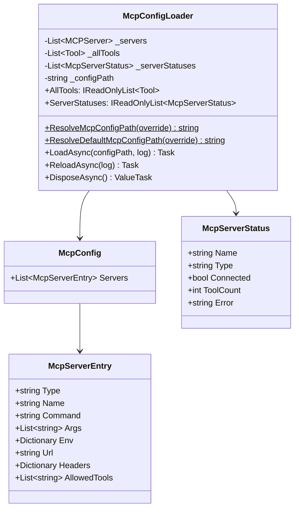
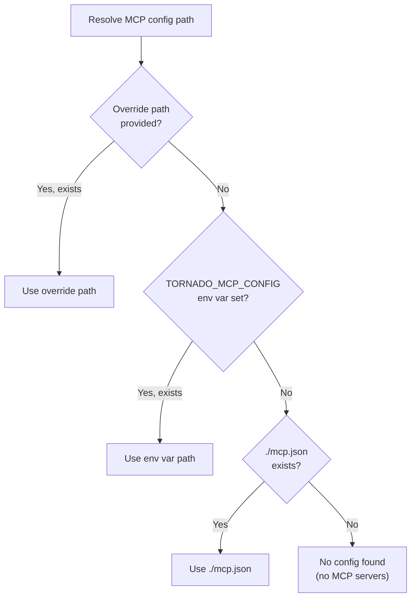
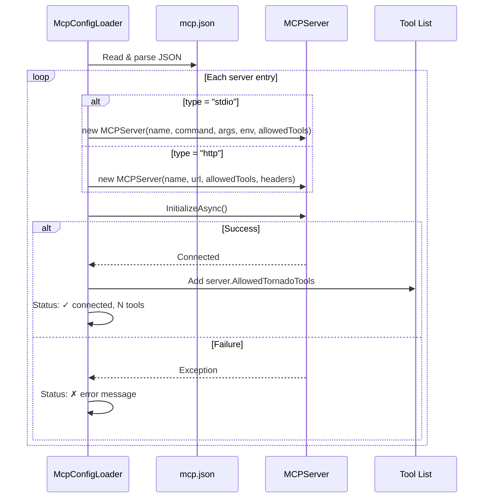
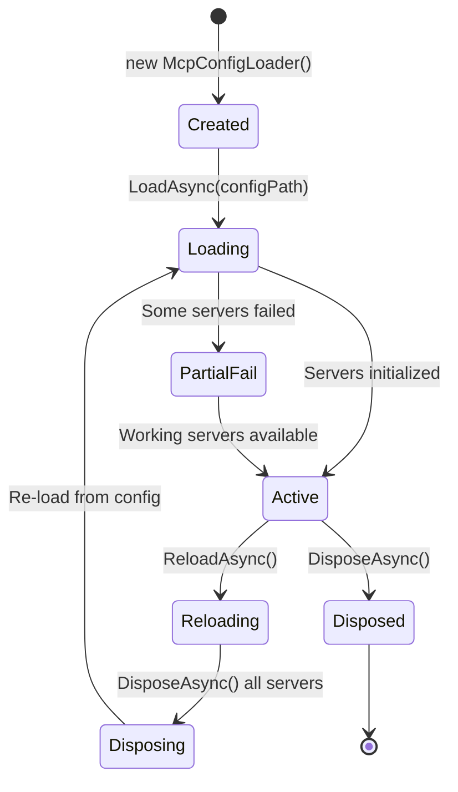
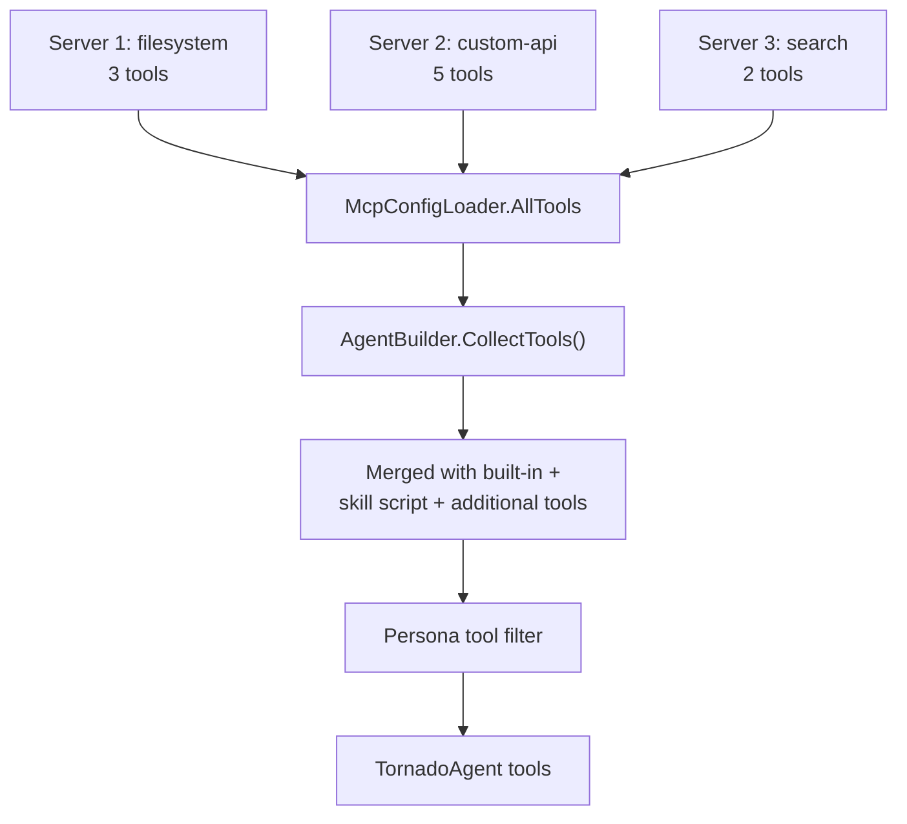
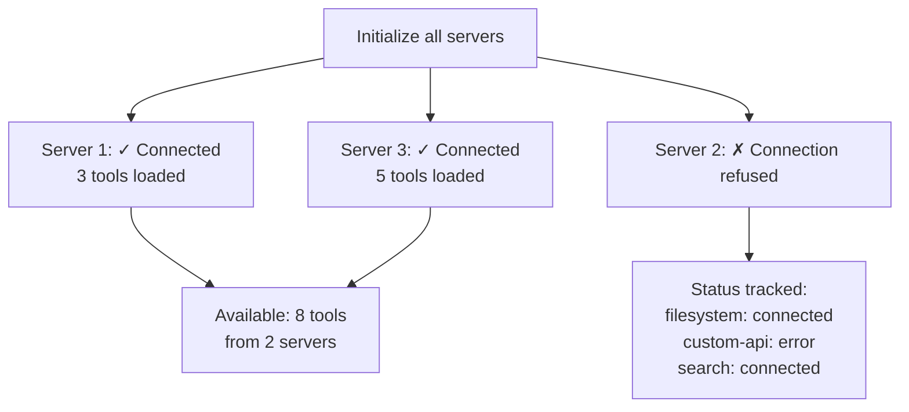

# 07 — MCP Server Integration

The MCP (Model Context Protocol) integration loads tool-providing servers from a JSON config file, initializes them (stdio or HTTP), and exposes their tools to the agent.

## Architecture



## Config File Resolution



## Config File Format

The MCP configuration is a JSON file listing servers to connect to:

```json
{
  "servers": [
    {
      "type": "stdio",
      "name": "filesystem",
      "command": "npx",
      "args": ["-y", "@anthropic/mcp-server-filesystem", "/path/to/allowed"],
      "env": {
        "NODE_ENV": "production"
      },
      "allowedTools": ["read_file", "write_file", "list_directory"]
    },
    {
      "type": "http",
      "name": "custom-api",
      "url": "https://mcp.example.com/v1",
      "headers": {
        "Authorization": "Bearer ${MCP_API_TOKEN}"
      }
    }
  ]
}
```

### Server Entry Fields

| Field | Type | Required | Description |
|-------|------|----------|-------------|
| `type` | string | Yes | `"stdio"` or `"http"` |
| `name` | string | Yes | Display name for logging |
| `command` | string | stdio only | Command to execute |
| `args` | string[] | No | Command arguments |
| `env` | object | No | Environment variables for the process |
| `url` | string | http only | Server URL |
| `headers` | object | No | HTTP headers |
| `allowedTools` | string[] | No | Whitelist of tool names (null = all) |

### Environment Variable Expansion

All string values in the config support `${VAR_NAME}` expansion:


This applies to `command`, `args`, `url`, `env` values, and `headers` values.

## Server Initialization



## Server Lifecycle



### Reload Process

`ReloadAsync()` performs a full tear-down and re-initialization:

1. `DisposeAsync()` — disconnect all servers
2. Clear internal lists (servers, tools, statuses)
3. `LoadAsync()` — re-read config and reconnect

This supports live-reloading when the config file changes.

## Tool Collection & Integration

MCP tools are collected after initialization and exposed via `AllTools`:



### Tool Name Resolution

MCP tools use the `MCPServer`'s tool name format. The `AgentBuilder` uses `tool.ResolvedName` (which maps to `Function.Name` for MCP tools) for:
- Tool permission registration
- Tool optimizer identification
- Persona whitelist/blacklist matching

## Error Handling

Each server is initialized independently. A failure in one server does not affect others:



The `McpServerStatus` list tracks the state of each server for diagnostic display.

## Resource Cleanup

`McpConfigLoader` implements `IAsyncDisposable`. On disposal:

1. Iterates all connected `MCPServer` instances
2. Calls `server.McpClient.DisposeAsync()` on each
3. Best-effort — exceptions are swallowed to ensure all servers are attempted

```csharp
// Usage pattern
await using McpConfigLoader mcpLoader = new();
await mcpLoader.LoadAsync(configPath);
// ... use tools ...
// Disposed automatically at end of scope
```
