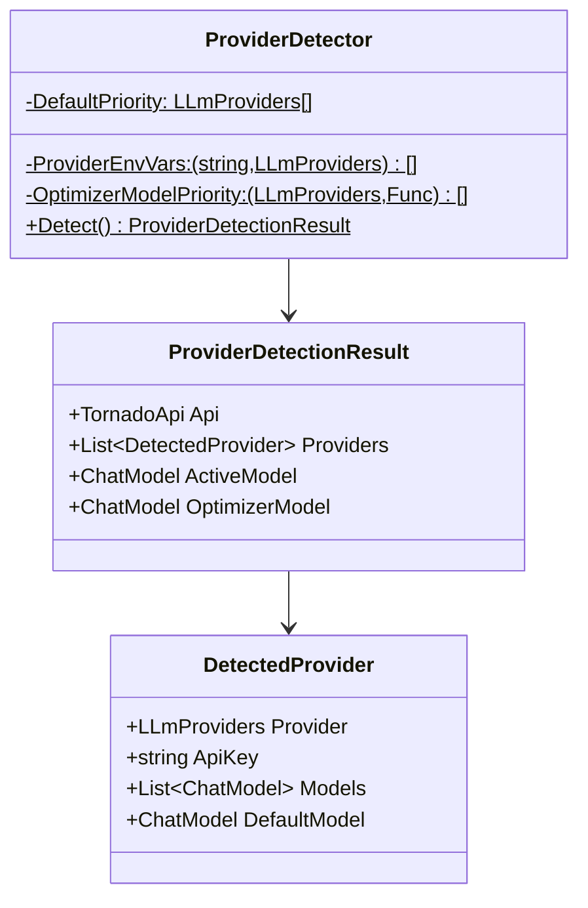
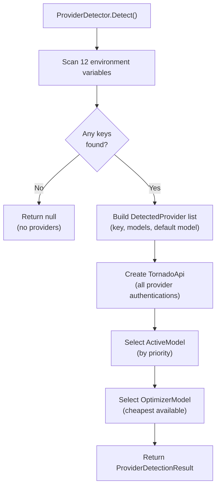
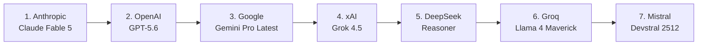
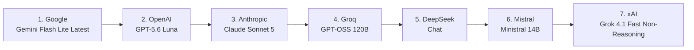
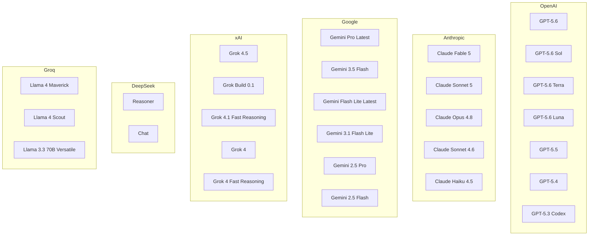
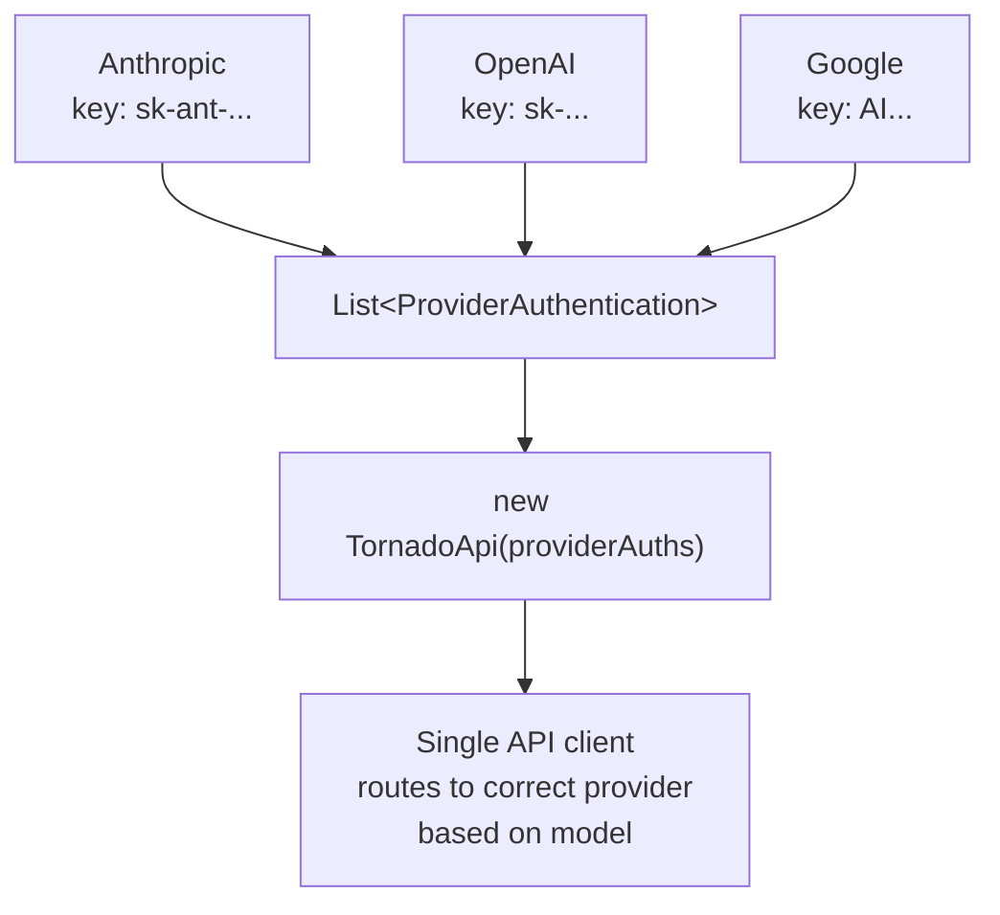
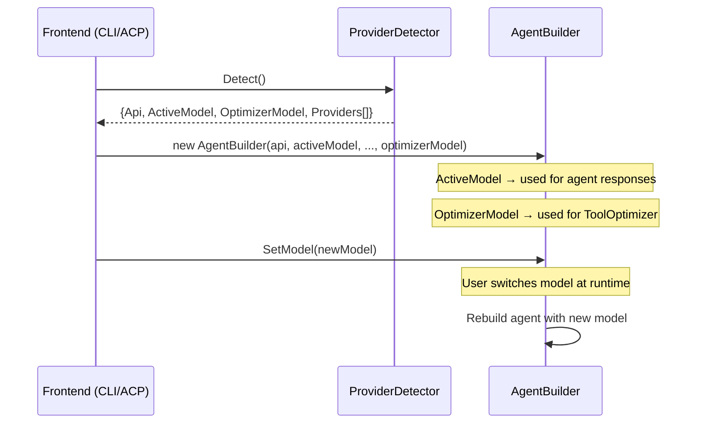

# 08 — LLM Provider Detection

The provider detection system automatically discovers available LLM providers by scanning standard environment variables, then selects the best default model and a cheap optimizer model.

## Architecture

## Detection Flow

## Environment Variables

The detector scans these environment variables in order:

| Environment Variable | Provider |
|---------------------|----------|
| `OPENAI_API_KEY` | OpenAI |
| `ANTHROPIC_API_KEY` | Anthropic |
| `GOOGLE_API_KEY` | Google |
| `GROQ_API_KEY` | Groq |
| `COHERE_API_KEY` | Cohere |
| `MISTRAL_API_KEY` | Mistral |
| `DEEPSEEK_API_KEY` | DeepSeek |
| `XAI_API_KEY` | xAI |
| `PERPLEXITY_API_KEY` | Perplexity |
| `OPENROUTER_API_KEY` | OpenRouter |
| `DEEPINFRA_API_KEY` | DeepInfra |
| `VOYAGE_API_KEY` | Voyage |

## Default Model Selection

When multiple providers are detected, the **active model** is chosen by this priority (best model from the highest-priority available provider):

### Default Models per Provider

| Provider | Default Model |
|----------|--------------|
| Anthropic | Claude Fable 5 |
| OpenAI | GPT-5.6 |
| Google | Gemini Pro Latest |
| xAI | Grok 4.5 |
| DeepSeek | Reasoner |
| Groq | Llama 4 Maverick |
| Mistral | Devstral 2512 |
| Cohere | Command A Reasoning 2508 |
| Perplexity | Sonar Reasoning Pro |

## Optimizer Model Selection

The optimizer model is used for internal tasks like tool optimization (see [09-tool-optimization.md](09-tool-optimization.md)). It prioritizes **cheapest/fastest** models:

**Fallback**: If none of the priority providers are available, the first detected provider's default model is used.

## Available Models per Provider

Each detected provider exposes a curated list of models the user can switch to at runtime:

Additional providers

| Provider | Models |
|----------|--------|
| **Mistral** | Devstral 2512, Mistral Medium 2508, Magistral Medium 2509, Mistral Large 2512 |
| **Cohere** | Command A Reasoning 2508, Command A 0325, Command A Vision 2507 |
| **Perplexity** | Sonar Reasoning Pro, Sonar Pro, Sonar Deep Research, Sonar Default |

## TornadoApi Construction

All detected providers are combined into a single `TornadoApi` instance:

This means the application can use any detected model seamlessly — the `TornadoApi` routes requests to the correct provider based on the model being used.

## Integration with AgentBuilder

