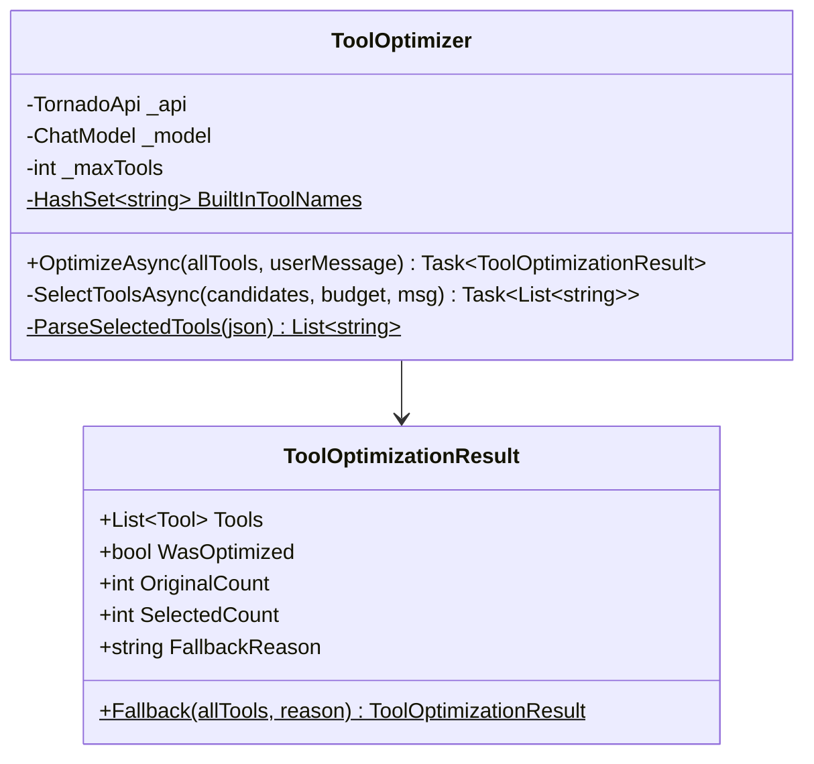
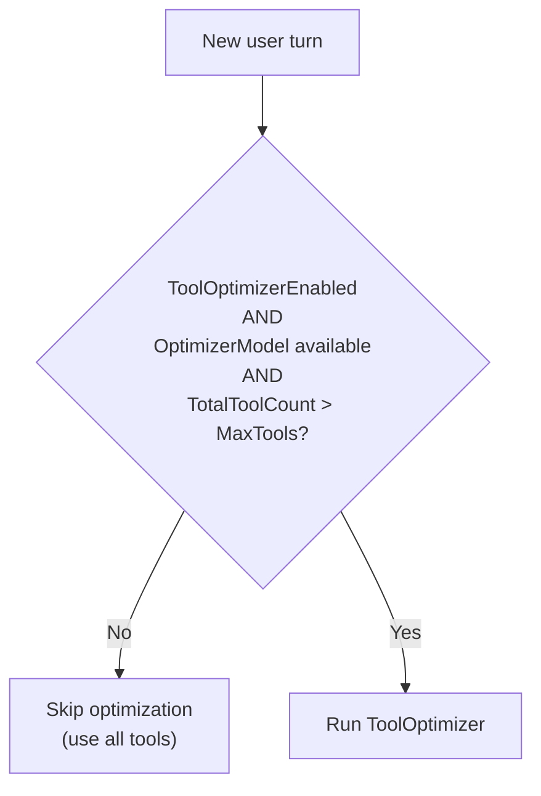
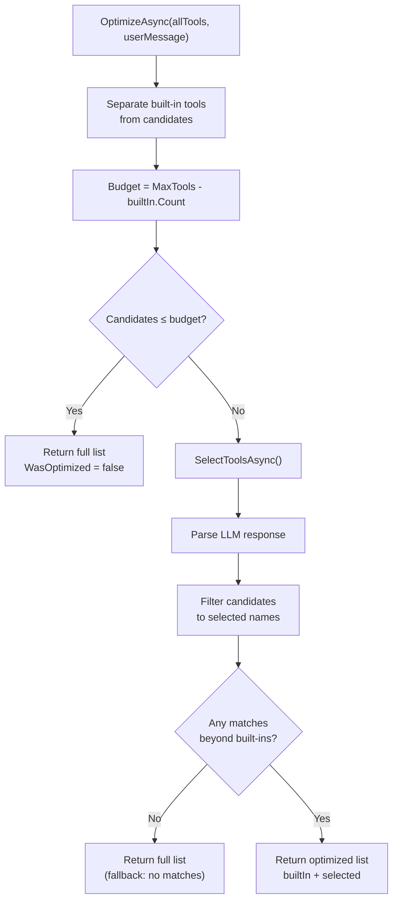
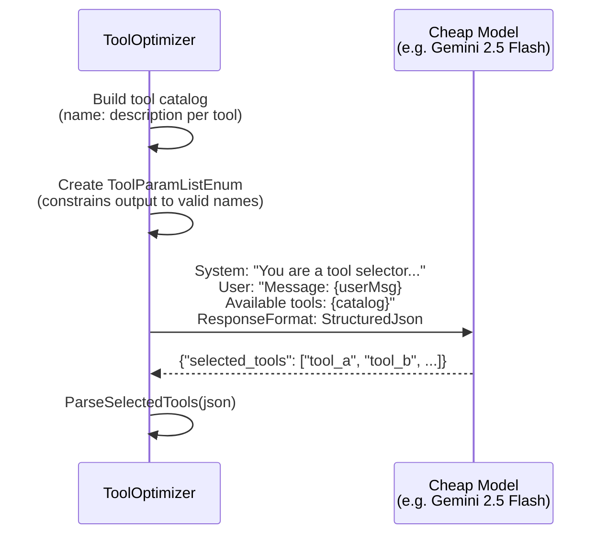
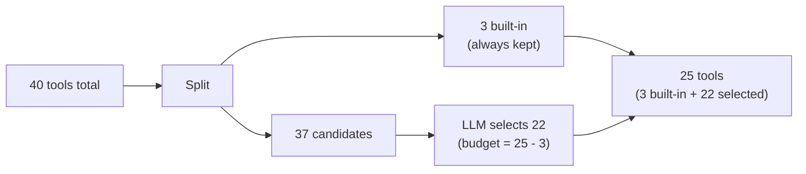
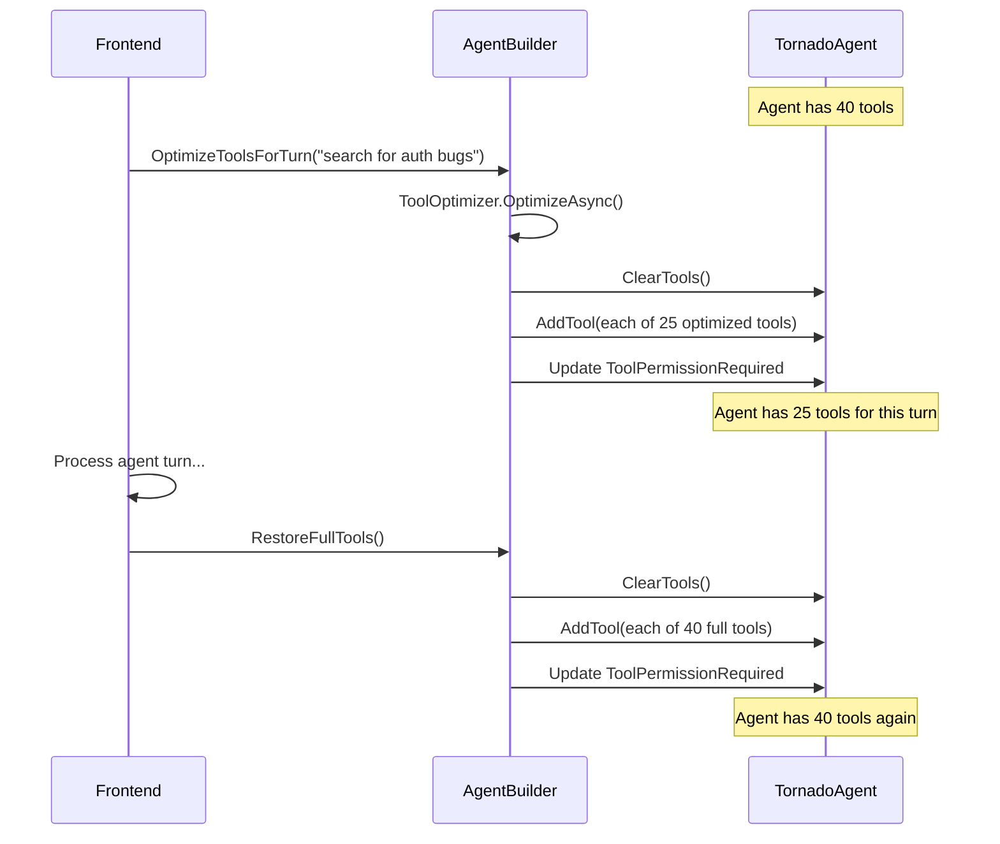
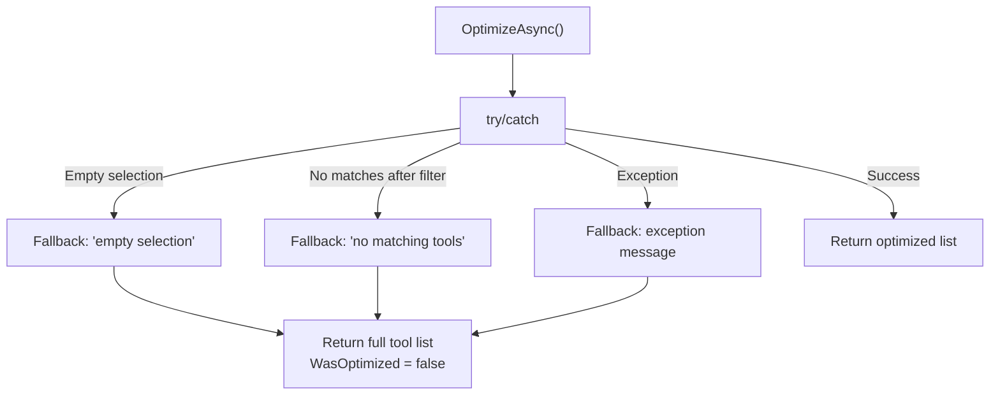

# 09 — Tool Optimization

When the total number of available tools exceeds a configurable threshold, the tool optimizer uses a cheap LLM to select the most relevant subset for each user turn. This keeps tool counts manageable for the primary model.

## Architecture



## When Optimization Triggers



Default threshold: **25 tools**. With built-in tools (3) + multiple skill scripts + MCP tools, this threshold can easily be exceeded.

## Optimization Flow



## LLM Selection Call

The optimizer uses **structured output** with `ToolParamListEnum` to constrain the LLM's response to only valid tool names:



### System Prompt

```
You are a tool selector. Given a user's message and a catalog of available tools,
select the {budget} tools most relevant to fulfilling the user's request.
Consider what operations the user might need and pick tools that would be useful.
If fewer than {budget} tools are relevant, select only the relevant ones.
```

### User Prompt

```
User message: {userMessage}

Available tools:
- filesystem__read_file: Read the contents of a file
- filesystem__write_file: Write content to a file
- web-search__search: Search the web for information
- note-taker__create: Create a new note
- ...
```

### Response Schema

```json
{
  "selected_tools": ["filesystem__read_file", "filesystem__write_file", "web-search__search"]
}
```

The `ToolParamListEnum` ensures the LLM can only output valid tool names from the provided catalog.

## Built-in Tool Protection

Three tools are **always included** regardless of optimization:

| Tool | Reason |
|------|--------|
| `load_skill` | Must always be able to activate skills |
| `list_skills` | Must always be able to discover skills |
| `read_reference` | Must always be able to read skill references |

These are separated before optimization and added back unconditionally:



## Agent Tool Swapping

The `AgentBuilder` manages swapping tools on the agent for each turn:



## Fallback Scenarios

The optimizer degrades gracefully on any failure:



All fallback results include the `FallbackReason` for diagnostic logging.

## Configuration

| Setting | Default | Description |
|---------|---------|-------------|
| `ToolOptimizerEnabled` | `true` | Master switch for optimization |
| `MaxTools` | `25` | Threshold that triggers optimization |

Both can be changed at runtime via `AgentBuilder`:

```csharp
builder.SetOptimizerEnabled(true, optimizerModel);
builder.SetMaxTools(30, optimizerModel);
```

## Cost Considerations

The optimizer uses the **cheapest available model** (see [08-provider-detection.md](08-provider-detection.md)):

| Priority | Model | Why |
|----------|-------|-----|
| 1 | Google Gemini 2.5 Flash | Free tier, very fast |
| 2 | OpenAI O4 Mini | Low cost per token |
| 3 | Anthropic Claude 4 Sonnet | Mid-tier pricing |
| 4 | Groq Llama 4 Scout | Free/very cheap |
| 5+ | DeepSeek, Mistral, xAI | Various |

The optimization call is lightweight — it sends only tool names + descriptions (not full schemas) plus the user message, and receives a small JSON array back.
