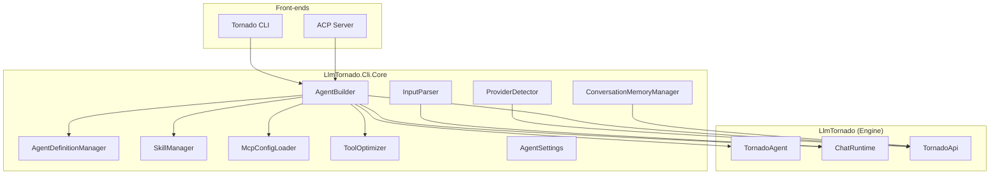

# LlmTornado.Cli.Core — Architecture Documentation

This directory contains detailed documentation of the **CLI Core** library — the shared infrastructure that powers both the **Tornado CLI** and the **ACP Server** front-ends.

## Documents

| Document | Description |
|----------|-------------|
| [01-overview.md](01-overview.md) | High-level architecture, project structure, and component map |
| [02-agent-builder.md](02-agent-builder.md) | The `AgentBuilder` — central orchestrator that assembles the agent and runtime |
| [03-agent-personas.md](03-agent-personas.md) | Agent persona system: discovery, parsing, capability curation, and project context |
| [04-skills-system.md](04-skills-system.md) | Skills lifecycle: discovery, activation, script execution, and approval gating |
| [05-memory-system.md](05-memory-system.md) | Conversation memory: compression strategy, LLM summarization, and persistence |
| [06-input-processing.md](06-input-processing.md) | Input parsing: `@path` file references and multimodal message construction |
| [07-mcp-integration.md](07-mcp-integration.md) | MCP server integration: config loading, initialization, and tool collection |
| [08-provider-detection.md](08-provider-detection.md) | LLM provider auto-detection from environment variables |
| [09-tool-optimization.md](09-tool-optimization.md) | Per-turn LLM-based tool subset selection |

## Quick Architecture Diagram

